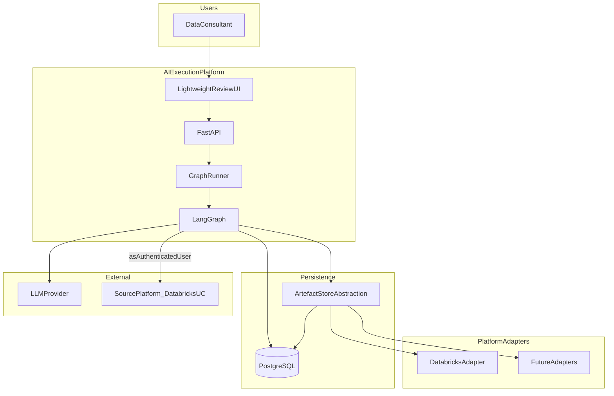
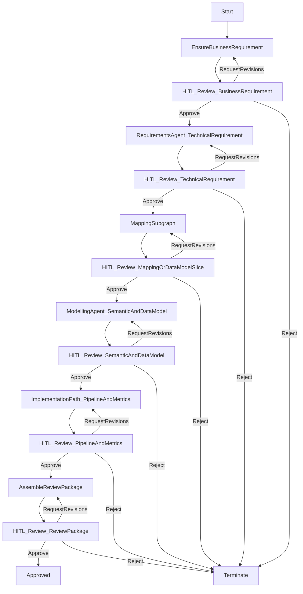
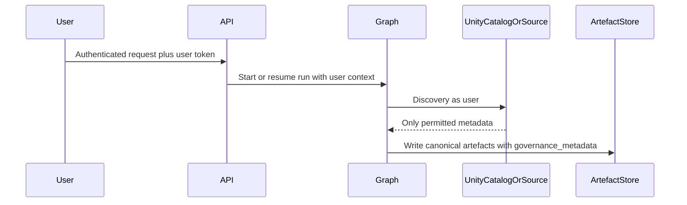

# Architecture — Agentic Data Product Accelerator

| Field | Value |
| --- | --- |
| **Status** | MVP technical architecture |
| **Based on** | [`PRODUCT_SPEC.md`](PRODUCT_SPEC.md) v1.3 |
| **Informed by** | [`ARCHITECTURE_REVIEW.md`](ARCHITECTURE_REVIEW.md) v1.1 |
| **Stack** | Python, uv, FastAPI, LangGraph, PostgreSQL |
| **Document version** | 1.0 |

---

## 1. Goals

Deliver a robust MVP that:

1. Orchestrates multi-agent data product design with **LangGraph**.  
2. Persists runs and artefacts durably in **PostgreSQL**.  
3. Enforces **human-in-the-loop** review after each generated artefact.  
4. Produces **technology-agnostic canonical artefacts**.  
5. Isolates platform-specific outputs behind **adapters**, with **Databricks** as the first target.  
6. Remains extensible for Fabric, Snowflake, Power BI, and others without changing upstream agents.

This document specifies *how* the system is built. Product intent and scope remain in `PRODUCT_SPEC.md`.

---

## 2. Architectural principles

| Principle | Implication |
| --- | --- |
| Canonical first | Agents read/write only the seven canonical artefacts |
| Adapters last | Databricks (etc.) materialisation is outside the agent graph |
| Durable HITL | PostgreSQL checkpointer; interrupts map to API decisions |
| Storage abstraction | Artefact payloads accessed via an interface (Postgres now, object storage later) |
| User-scoped access | Discovery uses the authenticated user’s identity; no privilege elevation |
| Fixed graph, config profiles | One compiled LangGraph; P1 = runtime configuration, not a workflow designer |
| Typed contracts | Pydantic models for artefacts, review decisions, and run state |
| Incremental delivery | Vertical slices; each milestone leaves a runnable system |

---

## 3. System context



---

## 4. Logical layers

| Layer | Components | Responsibility |
| --- | --- | --- |
| **Presentation** | Lightweight review UI | Submit Business Requirement; show workflow progress; review artefacts; Approve / Reject / Request revisions |
| **API** | FastAPI | Authn context, run lifecycle, artefact CRUD/read, review decisions, operator traces |
| **Orchestration** | LangGraph (+ optional worker) | Agent pipeline, subgraphs, interrupts, retries |
| **Domain** | Canonical artefact models | Versioned Business Requirement → … → Review Package |
| **Persistence** | PostgreSQL + ArtefactStore | Checkpoints, metadata, audit, lineage, artefact bodies |
| **Integrations** | LLM client; source discovery tools | Generation and permitted schema discovery |
| **Adapters** | Databricks adapter (first) | Optional post-approval materialisation of platform assets |

---

## 5. Persistence design

### 5.1 PostgreSQL

PostgreSQL is the **primary application database** and the **LangGraph checkpointer** store.

| Data | Storage |
| --- | --- |
| LangGraph checkpoints / threads | Postgres checkpointer tables |
| Runs, stage status, pending reviews | Application tables |
| Canonical artefact versions + metadata | Application tables (JSONB or equivalent) via ArtefactStore |
| Audit events | Append-oriented audit table |
| Lineage edges | Lineage table (from_artefact_version → to_artefact_version) |

### 5.2 Artefact store abstraction

```text
ArtefactStore
  save(artefact_type, payload, parent_versions, run_id) -> ArtefactRef
  get(artefact_id, version) -> Artefact
  list_for_run(run_id) -> [ArtefactRef]
```

- **MVP backend:** PostgreSQL.  
- **Future backend:** object storage for large payloads; metadata/lineage may remain in Postgres.  
- Agents and graph nodes depend on `ArtefactStore` / refs in state — **not** on SQL or blob APIs directly.

### 5.3 Graph state

LangGraph state holds **identifiers and small control fields** (run_id, current_stage, artefact refs, feedback text, retry counts). Large JSON documents live in the ArtefactStore.

---

## 6. Canonical artefact contracts

Each artefact is a versioned Pydantic model (exact fields formalised in implementation Milestone 1). Minimum expectations:

| Artefact | Core content |
| --- | --- |
| Business Requirement | Intent, objectives, constraints, success criteria |
| Technical Requirement | Behaviour, entities, transformations, governance requirements, acceptance criteria |
| Semantic Model | Metrics, dimensions, hierarchies, relationships, business definitions |
| Data Model | Datasets, entities, attributes, keys, relationships; mapping context; optional governance labels |
| Pipeline Specification | Ingestion, transformation, orchestration, validation, lineage, operational behaviour (declarative) |
| Metric Definitions | KPI calc, aggregation, filters, grain, business logic |
| Review Package | Pinned artefact refs, assumptions, traceability, validation results, unresolved questions, recommendations, decision state |

Optional common envelope on all artefacts: `id`, `version`, `run_id`, `created_at`, `created_by`, `governance_metadata`, `source_refs`.

---

## 7. LangGraph orchestration

### 7.1 Top-level flow



Exact stage boundaries may group Semantic Model + Data Model into one review when produced together; the product rule remains: **no progression without human review of the generated artefact(s) for that stage**.

### 7.2 HITL decision contract

```text
ReviewDecision:
  decision: approve | reject | request_revisions
  comments: str
  reviewer_id: str
  artefact_ref: ArtefactRef
```

| Decision | Graph behaviour |
| --- | --- |
| `approve` | Advance to next node/subgraph |
| `reject` | Transition to terminal `terminated` status; no further generation |
| `request_revisions` | Persist feedback on the run; re-enter the **generator node for the current artefact**; new version written; return to the same HITL interrupt |

Regeneration is always of the **current stage’s artefact**, not a full run restart (unless reject + new run is chosen by the user outside the graph).

### 7.3 Mapping subgraph

Discovery → Data Mapping → Mapping Judge, with capped retries:

- Schema issues → Discovery  
- Logic issues → Data Mapping  
- Exhausted retries → escalate to HITL with last proposal + judge notes  

Discovery tools **must** execute with the authenticated user’s credentials against the source platform (or load fixtures that simulate the same visibility).

### 7.4 Implementation path (MVP)

Linear path (no complex supervisor):

1. Engineer agent → Pipeline Specification  
2. Deterministic/static validation  
3. Metrics agent → Metric Definitions  
4. HITL on those artefacts  
5. Assemble Review Package  

No unsandboxed execution of vendor code in MVP.

### 7.5 Subgraph packaging

Compile Mapping and Implementation as LangGraph subgraphs with typed inputs/outputs for independent tests.

---

## 8. API surface (MVP)

Illustrative resources (OpenAPI to be authored in implementation):

| Area | Endpoints (conceptual) |
| --- | --- |
| Runs | `POST /runs`, `GET /runs/{id}`, `GET /runs/{id}/status` |
| Artefacts | `GET /runs/{id}/artefacts`, `GET /artefacts/{id}` |
| Reviews | `GET /runs/{id}/pending-review`, `POST /runs/{id}/reviews` (decision body) |
| Audit / lineage | `GET /runs/{id}/audit`, `GET /runs/{id}/lineage` |
| Ops | `GET /runs/{id}/events` (agent node traces for P2/P3) |
| Config | `GET/PUT /config/profiles` (narrow P1) |

`thread_id` (LangGraph) equals `run_id` for correlation.

---

## 9. Lightweight UI

Single consultant-oriented UI with four capabilities only:

1. Submit Business Requirement  
2. View workflow progress / stage  
3. Review artefact content (and Review Package)  
4. Submit Approve / Reject / Request revisions  

No multi-role admin console in MVP.

---

## 10. Security architecture



| Rule | Enforcement |
| --- | --- |
| Operate as authenticated user | User context propagated into tool calls |
| No elevation | No shared admin principal for discovery in user-driven runs |
| No inaccessible data | Generators must not invent entities from unseen sources |
| Propagate governance metadata | Labels/classifications copied into artefact envelope when present |
| No app RBAC engine | Workflow defines HITL points; authentication is sufficient for MVP access to the app |

Secrets (LLM keys, optional Databricks tokens) live in environment/secret store — never in graph state or audit plaintext.

---

## 11. Platform adapter architecture

```text
CanonicalArtefacts (approved)
        │
        ▼
 PlatformAdapter.to_platform(artefacts, target_config) -> AdapterResult
        │
        ├── DatabricksAdapter  (first)
        ├── FabricAdapter      (future)
        ├── SnowflakeAdapter   (future)
        └── PowerBIAdapter     (future)
```

- Adapters are **read-only consumers** of approved canonical artefacts.  
- Agents never call adapter write APIs during generation.  
- MVP acceptance does **not** require live deploy; adapter may be stubbed or export-only.  
- Databricks is first because it is available for development/demo — not because the core is Databricks-specific.

---

## 12. Observability

- Emit structured events: `node_started`, `node_finished`, `interrupt_waiting`, `decision_applied`, `run_terminated`, `error`.  
- Persist events in PostgreSQL for P2/P3 and UI progress.  
- Optional LangSmith (or equivalent) later; not required to meet MVP if in-app events suffice.

---

## 13. Repository structure (suggested)

```text
/
  pyproject.toml          # uv-managed
  PRODUCT_SPEC.md
  ARCHITECTURE.md
  ARCHITECTURE_REVIEW.md
  IMPLEMENTATION_PLAN.md
  src/
    app/                  # FastAPI
    orchestration/        # LangGraph graphs, nodes, interrupts
    domain/               # Pydantic canonical artefacts
    persistence/          # ArtefactStore, audit, lineage, checkpointer wiring
    integrations/         # LLM, source discovery
    adapters/             # databricks/, ...
    ui/                   # lightweight review UI
  tests/
```

---

## 14. Testing strategy

| Layer | Focus |
| --- | --- |
| Unit | Artefact schema validation; decision reducers; judge routing; retry caps |
| Graph | Resume after Approve; terminate on Reject; Request revisions loops; subgraph I/O |
| API | Run create/status; pending review; decision application |
| Security | Discovery tools receive user context; elevated path absent |
| Adapter | Pure mapping from fixtures of approved artefacts → Databricks-shaped output (no live deploy required) |

---

## 15. Non-goals (architecture MVP)

- Application role administration UI  
- Multi-tenant isolation productisation  
- Live pipeline deployment as a success criterion  
- Workflow designer / dynamic graph builder  
- Executing generated Databricks code in-process  

---

## 16. Open engineering choices

Tracked for early milestones (see also architecture review §4):

1. LLM vendor/model and residency  
2. Auth protocol and token passthrough to Databricks  
3. Fixture-first vs live UC discovery for first demo  
4. In-process vs worker process for graph execution  
5. Exact JSON schemas per artefact  

---

## 17. Document history

| Version | Notes |
| --- | --- |
| 1.0 | Initial MVP architecture aligned to PRODUCT_SPEC v1.3 |
