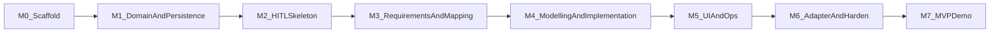

# Implementation Plan — Agentic Data Product Accelerator

| Field | Value |
| --- | --- |
| **Status** | MVP delivery plan |
| **Based on** | [`PRODUCT_SPEC.md`](PRODUCT_SPEC.md) v1.3, [`ARCHITECTURE.md`](ARCHITECTURE.md) v1.0 |
| **Target** | September 2026 MVP |
| **Primary user** | Data Consultant |
| **Document version** | 1.0 |

---

## 1. Delivery principles

1. **Incremental vertical slices** — each milestone leaves something runnable and reviewable.  
2. **Validate before expanding** — HITL and persistence proven before adding all agents.  
3. **Canonical before adapters** — do not build Databricks materialisation until artefacts and reviews work.  
4. **Keep the architecture maintainable** — storage abstraction, adapter interface, and typed artefacts from the start.  
5. **Do not reopen settled product decisions** — consultant-first UI, no app RBAC, Approve / Reject / Request revisions, Postgres persistence.

---

## 2. Milestone overview

| Milestone | Outcome | Primary validation |
| --- | --- | --- |
| **M0** | Repo, uv, FastAPI hello, Postgres connectivity | CI install + healthcheck — **complete** |
| **M1** | Artefact schemas + ArtefactStore + audit/lineage tables | Round-trip save/load versions — **complete** |
| **M2** | Minimal LangGraph + Postgres checkpointer + HITL API | Approve / Reject / Request revisions on one dummy artefact — **complete** |
| **M3** | Business → Technical Requirement + Mapping subgraph + reviews | End-to-end through mapping HITL with fixtures |
| **M4** | Semantic/Data Model, Pipeline Spec, Metric Definitions, Review Package | Full canonical path with per-stage reviews |
| **M5** | Lightweight UI + run progress + operator events | Consultant can complete a run in the UI |
| **M6** | Databricks adapter interface (+ stub/export); hardening | Adapter maps approved artefacts; security checks |
| **M7** | Demo script, polish, DoD checklist | Stakeholder MVP demonstration |

---

## 3. Milestone detail

### M0 — Scaffolding

**Status:** Complete — evidence in [`docs/milestones/M0/`](docs/milestones/M0/)

**Deliverables**

- `uv` project (`pyproject.toml` + `uv.lock`), lint/test tooling  
- FastAPI app skeleton with `/health` and `/ready`  
- Docker Compose for PostgreSQL (+ optional API service)  
- Empty package layout per `ARCHITECTURE.md`  
- Config, logging, lifespan, DB ping scaffold, CI, pre-commit  

**Validation**

- `uv sync` and unit tests run locally / in CI  
- API `/health` returns 200; `/ready` returns 200 when Postgres is up  
- Integration job in GitHub Actions runs against service Postgres  

**Exit criteria**

- Developers can start API + Postgres with documented commands (see README)  

---

### M1 — Domain model and persistence

**Status:** Complete — evidence in [`docs/milestones/M1/`](docs/milestones/M1/)

**Deliverables**

- Pydantic models for all seven canonical artefacts (initial field sets)  
- `ArtefactStore` interface + PostgreSQL implementation  
- Tables: artefacts, runs, audit, lineage  
- Lightweight SQL migrations (`make migrate`; Alembic not required for M1)  
- Dev persistence APIs under `/dev/...`  

**Validation**

- Unit tests for schema validation  
- Integration test: create run → save artefact versions → query lineage / audit  
- `make verify` green with Postgres  

**Exit criteria**

- Artefact versioning and audit write path proven without agents  

---

### M2 — HITL skeleton

**Status:** Complete — evidence in [`docs/milestones/M2/`](docs/milestones/M2/)

**Deliverables**

- LangGraph with PostgreSQL checkpointer  
- One generator node producing a stub artefact  
- Interrupt + resume for **Approve / Reject / Request revisions**  
- API: `POST /runs`, `GET /runs/{id}`, `POST /runs/{id}/reviews`  
- Request revisions writes feedback and regenerates **current** artefact version  

**Validation**

- Automated graph tests for all three decisions  
- Reject leaves run `terminated`  
- Request revisions increments artefact version and returns to interrupt  

**Exit criteria**

- Durable HITL works across API process restart  

---

### M3 — Requirements and mapping

**Deliverables**

- Requirements Agent: Business Requirement → Technical Requirement  
- Mapping subgraph: Discovery (fixture-first), Data Mapping, Mapping Judge with retry caps  
- HITL after Technical Requirement and after mapping/data-model slice  
- User context plumbing for discovery tools (fixture mode simulates permission filtering)  

**Validation**

- Golden fixture: sample Business Requirement → expected Technical Requirement properties  
- Judge retry cap and escalation covered by tests  
- Inaccessible fixture objects never appear in outputs  

**Exit criteria**

- Consultant (API) can approve through mapping stage  

---

### M4 — Modelling, implementation path, Review Package

**Deliverables**

- Modelling agent → Semantic Model + Data Model  
- Linear implementation path → Pipeline Specification + Metric Definitions  
- Static validation of Pipeline Specification  
- Assemble Review Package (assumptions, traceability, validation results, open questions, recommendations)  
- HITL at modelling, implementation, and Review Package stages  

**Validation**

- Full-graph integration test with fixtures (approve-all path)  
- Reject at mid-stage terminates  
- Request revisions on Metric Definitions only regenerates that stage  

**Exit criteria**

- All seven artefacts produced and approvable via API  

---

### M5 — Lightweight UI and observability

**Deliverables**

- UI: submit Business Requirement, progress view, artefact viewer, decision controls  
- Run event stream/list for operator traces (P2/P3 baseline)  
- Runtime config profile endpoint (narrow P1)  

**Validation**

- Manual script: consultant completes happy path in UI  
- Progress reflects waiting_for_review / running / terminated / approved  
- Agent events visible for a completed run  

**Exit criteria**

- Demo can be run without raw API clients  

---

### M6 — Adapter boundary and hardening

**Deliverables**

- `PlatformAdapter` interface  
- `DatabricksAdapter` stub or export (YAML/JSON/notebooks-as-files from canonical artefacts) — **no deploy required**  
- Security review checklist: no elevated discovery path; governance_metadata propagated  
- Basic eval set (2–3 golden requirements)  
- Error taxonomy and structured logging cleanup  

**Validation**

- Adapter unit tests from frozen approved artefact fixtures  
- Negative test: discovery without user context fails closed  
- Load smoke: two concurrent runs with separate checkpointer threads  

**Exit criteria**

- Architecture non-goals respected; adapter ready for future live deploy work  

---

### M7 — MVP demonstration and DoD

**Deliverables**

- Demo script and sample Business Requirement  
- Documentation pass: README runbook (commands, env vars)  
- Confirm PRODUCT_SPEC DoD checklist  

**Validation**

- Stakeholder walkthrough: submit → staged reviews → approved Review Package  
- Show audit + lineage  
- Show that outputs are canonical (and optional Databricks export)  

**Exit criteria**

- PRODUCT_SPEC §14.1 MVP definition of done satisfied  

---

## 4. Cross-cutting work (every milestone)

| Concern | Practice |
| --- | --- |
| Tests | Add/extend unit + graph tests with the feature |
| Migrations | Ship schema changes with the milestone |
| Secrets | Env-based; never commit credentials |
| Docs | Update README/runbook when commands change |
| Scope control | No app RBAC, no workflow designer, no live deploy as blockers |

---

## 5. Dependency and risk management

| Risk | Mitigation |
| --- | --- |
| LLM quality variance | Golden fixtures + human review; keep schemas strict |
| Timeline slip | Prefer cutting adapter live deploy and extra agents before cutting HITL or persistence |
| Source platform access delays | Fixture-first Discovery until UC token passthrough ready |
| Graph complexity | Keep implementation path linear; subgraph isolation |
| Checkpoint/schema drift | Single migration ownership; version artefact envelopes |

---

## 6. Suggested sequencing vs calendar (indicative)

Assuming continued build through August and MVP in September 2026:

| Window | Focus |
| --- | --- |
| Immediate | M0–M2 (scaffold, persistence, HITL skeleton) |
| Next | M3–M4 (full canonical agent path) |
| Then | M5 (UI + ops visibility) |
| Pre-demo | M6–M7 (adapter stub, harden, demo) |

Re-baseline dates with the Technical Product Lead if capacity changes; do not expand MVP scope to recover schedule.

---

## 7. Definition of done (plan-level)

The implementation plan is complete for MVP when:

1. Milestones M0–M7 exit criteria are met.  
2. [`PRODUCT_SPEC.md`](PRODUCT_SPEC.md) §14.1 checks pass.  
3. [`ARCHITECTURE.md`](ARCHITECTURE.md) non-goals were not violated.  
4. Remaining open engineering questions from the architecture review are either decided or explicitly parked with owners.

---

## 8. Document history

| Version | Notes |
| --- | --- |
| 1.0 | Initial incremental MVP implementation plan |
