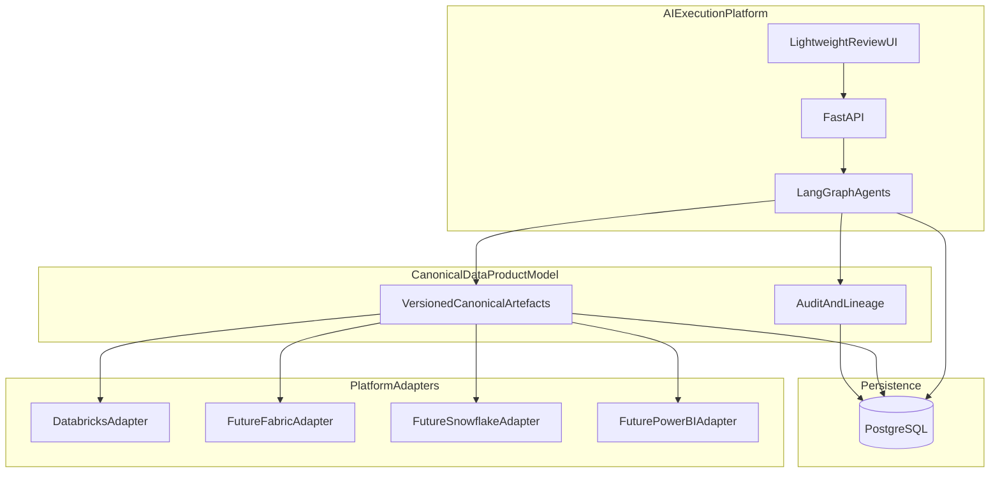
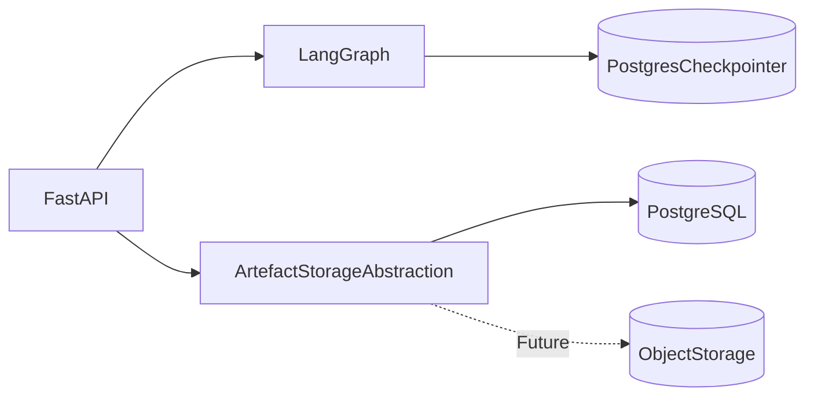
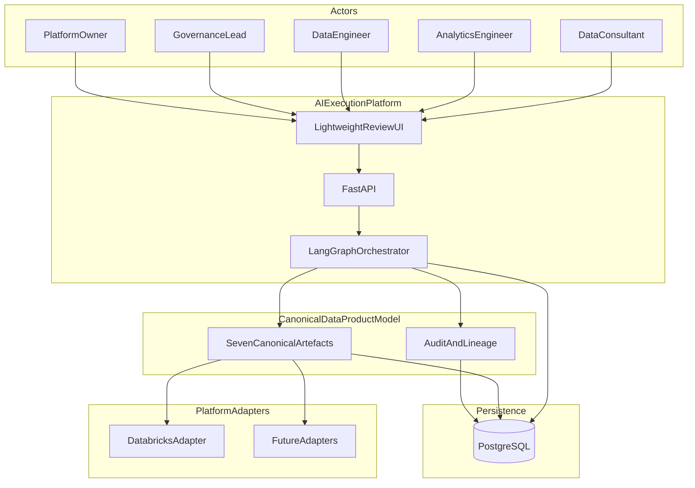
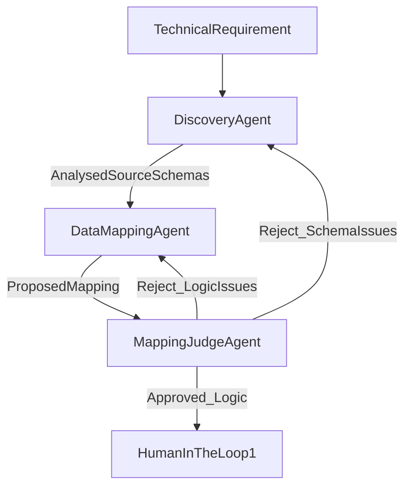
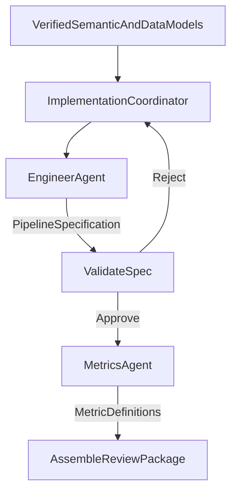
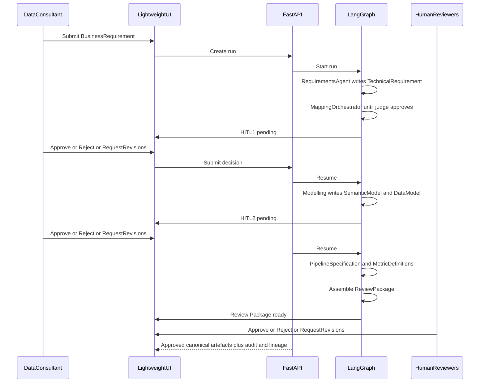

# Agentic Data Product Accelerator — Product Specification

| Field | Value |
| --- | --- |
| **Document status** | Canonical product specification |
| **Product name** | Agentic Data Product Accelerator |
| **Product type** | Agentic Data Product Design Platform |
| **Source material** | *Agentic Data Product Creation* project proposal; accepted architecture decisions (2026-07-20) |
| **Implementation stack** | Python, FastAPI, LangGraph, uv, PostgreSQL |
| **MVP target** | September 2026 (end-to-end core functionality) |
| **Document version** | 1.3 |

### Stakeholders

| Role | Name |
| --- | --- |
| Sponsor | Ogo Odili |
| Business Alignment | Angus Moreshead |
| Technical Product Lead | Will Archer |
| Product Developer | Raam Songara |

---

## 1. Vision and purpose

Empower users to design and deliver production-ready data products through agentic automation. The platform accelerates delivery, removes technical bottlenecks, and advances self-service analytics—while keeping outputs aligned with modelling, engineering, and governance best practice.

**This product is an Agentic Data Product Design Platform, not a Databricks code generator.** AI agents produce a governed, technology-agnostic **canonical data product model**. Platform-specific outputs (for example Databricks pipelines or Unity Catalog metric views) are produced afterwards by **platform adapters**, not by agents operating on vendor APIs.

Long-term, the platform enables non-technical **Business Users** to express needs and receive governed data products. The September MVP prioritises **Data Consultants** and demonstrates AI-assisted data product *design*—structured requirements, multi-agent artefact generation, and human review—rather than natural-language accessibility for non-technical self-service.

At its core, the solution redefines the relationship between requesters and technical specialists. Agents act as builders of canonical artefacts; consultants, engineers, and governance leads act as reviewers within a controlled, auditable process. Over time, the platform also supports iterative change so data products evolve with business needs.

---

## 2. Goals and success criteria

### 2.1 Primary goal

Deliver a Minimum Viable Product (MVP) by September 2026 that demonstrates core end-to-end **canonical data product design** functionality for Data Consultants, accelerates delivery, and establishes a scalable, vendor-neutral foundation for subsequent iterations (including Business User self-service and additional platform adapters).

### 2.2 Success criteria

The MVP is successful when:

1. A **Data Consultant** can submit structured **Business Requirements** via the lightweight review UI (or API), start a run, and receive the seven versioned **canonical artefacts**.
2. Facts, dimensions, and measures are identified from those requirements and presented for human review as part of the Semantic Model / Metric Definitions artefacts.
3. **Each AI-generated artefact is reviewed before the workflow progresses**; reviewers may **Approve**, **Reject** (terminate), or **Request revisions** (feedback → regenerate current artefact → re-review).
4. Reviewers can inspect the **Review Package** (artefacts, assumptions, traceability, validation results, unresolved questions, recommendations) and record a final decision.
5. Governance reviewers can assess compliance, inspect approval state, and rely on an audit trail plus requirement-to-artefact lineage across canonical artefacts.
6. Platform operators can apply basic workflow/runtime configuration and observe agent execution, interactions, and decisions.
7. Agents operate only on the **canonical data product model**; any Databricks-oriented output is produced via a **platform adapter** boundary (deploy remains out of MVP scope).
8. Runs are **durably persisted** (LangGraph checkpointer and application data in PostgreSQL) so HITL workflows survive process restarts.
9. Discovery and generation **operate as the authenticated user** on source platforms; the platform does not bypass or elevate access, and does not expose or generate from data the user cannot access.
10. The architecture (FastAPI + LangGraph + canonical model + adapters + abstracted storage) supports adding post-MVP capabilities and additional platforms without redesigning the core orchestration model.

---

## 3. Personas and target audiences

### 3.1 Target audiences

| Audience | Horizon | Intent |
| --- | --- | --- |
| **Data consultants** | **Primary MVP audience** | Faster project delivery through AI-assisted canonical artefact generation and governed review |
| **Business users** | **Long-term vision** | Self-service data product creation without deep technical knowledge of data models or databases |

MVP UX and messaging optimise for consultants demonstrating AI-assisted design. Natural-language accessibility for non-technical Business Users remains in the backlog (supported where already Must Have, but not the MVP focus).

### 3.2 Personas

| Persona | MVP relevance | Description |
| --- | --- | --- |
| **Data Consultant** | Primary actor | Submits requirements, monitors run status, reviews artefacts, and drives Approve / Reject / Request revisions in the lightweight UI |
| **Business User** | Future primary | Submits analytical needs with minimal technical knowledge; long-term self-service audience |
| **Analytics Engineer** | Reviewer | Reviews and validates semantic models, measures, dimensions, and calculation logic |
| **Data Engineer** | Reviewer | Reviews pipeline specifications, mappings, and transformation logic |
| **Data Governance Lead** | Reviewer | Ensures compliance, auditability, lineage, and approval controls before artefacts are approved |
| **Platform Owner** | Operator | Configures runtime/workflow settings and monitors agent operational health |

Personas describe **workflow participation** (who typically submits, reviews, or operates), not configurable application roles. In MVP, the same authenticated consultant may complete multiple HITL stages when the workflow reaches those review points. **Application-level RBAC is not an MVP requirement** (see [Section 4.3](#43-identity-security-and-source-platform-governance)).

---

## 4. Product philosophy and architectural layers

### 4.1 Design-first philosophy

| Principle | Statement |
| --- | --- |
| **Canonical first** | AI produces versioned canonical artefacts before any platform-specific materialisation |
| **Agents stay vendor-neutral** | Agents read and write only the canonical data product model (not vendor DSLs as primary outputs) |
| **Adapters last** | Platform adapters translate approved canonical artefacts into execution-environment assets |
| **Technology agnostic** | The upstream agent workflow and canonical model do not depend on Databricks, Fabric, Snowflake, or Power BI |
| **Databricks first (pragmatic)** | Databricks is the **first implementation target** because it is readily available for development and demonstration—not because the product is Databricks-native |
| **No vendor lock-in** | Core product value is the canonical model and review workflow; future adapters may target Microsoft Fabric, Snowflake, Power BI, and other ecosystems without changing upstream agents |
| **Source security preserved** | The platform always operates as the authenticated user on external data platforms; agents never bypass or elevate those permissions |

### 4.2 Layered architecture

| Layer | Responsibility |
| --- | --- |
| **AI execution platform** | FastAPI, lightweight review UI, LangGraph orchestration, HITL interrupts, run observability |
| **Canonical data product model** | Versioned artefacts, audit trail, lineage; technology-agnostic representations |
| **Persistence** | PostgreSQL for application data, artefacts (MVP), audit/lineage, and LangGraph checkpointer; storage abstraction for future object storage |
| **Platform adapters** | Map approved canonical artefacts to a target platform (Databricks first; Fabric, Power BI, Snowflake, and others later) |

### 4.3 Identity, security, and source-platform governance

**Application-level RBAC is not an MVP requirement.** Personas and approval stages must not be read as a configurable in-app permissions system (for example Submitter / Reviewer / Governance / Admin roles with role-management UI).

| Topic | MVP intent |
| --- | --- |
| **Authentication** | Users authenticate to use the API/UI; the authenticated identity is used when interacting with external data platforms |
| **Application RBAC** | **Not required for MVP.** No configurable application roles or role-management functionality |
| **Approvals / HITL** | Designated **workflow review points** (HITL 1, HITL 2, Review Package decisions). The workflow determines which human or agent acts at each stage—not an application permissions engine |
| **Source-platform enforcement** | Discovery and generation agents **must not bypass or elevate** the user’s existing permissions on platforms such as Databricks Unity Catalog |
| **Least privilege to data** | If the user cannot access a dataset, column, or metric through the source platform, the platform **must not** expose it or generate artefacts that depend on it |
| **Governance metadata** | Existing RBAC, sensitivity labels, classifications, and related governance metadata from the source platform should be **preserved where appropriate** and **propagated into generated canonical artefacts** |
| **Future application RBAC** | If needed later (for example multi-tenant or enterprise hosting), it can be introduced **without changing the core workflow architecture** |

G6 (“review access controls associated with generated artefacts”) and P8 (“manage access to platform capabilities”) remain Should/Could items for richer *application* or artefact ACL administration—not substitutes for source-platform enforcement, which is required whenever the platform accesses external data.

### 4.4 Persistence strategy

| Concern | MVP approach |
| --- | --- |
| **Primary application database** | **PostgreSQL** |
| **LangGraph durability** | LangGraph uses **PostgreSQL as its persistent checkpointer** to support durable execution and human-in-the-loop resume |
| **Canonical artefacts** | Stored in **PostgreSQL** for MVP (versioned documents/rows plus metadata) |
| **Workflow state** | Run/workflow state is durable via the LangGraph PostgreSQL checkpointer (and related application metadata in PostgreSQL) |
| **Metadata, audit, lineage** | Stored in **PostgreSQL** for MVP |
| **Storage abstraction** | Application code accesses artefacts through a **storage abstraction** so larger artefact payloads can later move to **object storage** without changing agent behaviour or the canonical model contract |

---

## 5. Canonical data product model

The platform generates **seven versioned, technology-agnostic canonical artefacts**. Together they are the **canonical definition of a data product**. Agents create and revise only these artefacts (plus supporting run/audit metadata). Platform-specific implementations are produced afterwards by **adapters** and must not replace or redefine the canonical model.

These artefacts remain **independent of any specific technology stack**. Databricks, Fabric, Snowflake, Power BI, and other platforms consume adapter outputs derived from this model—they are not the source of truth.

### 5.1 Artefact catalogue

#### Business Requirement

Structured representation of the user’s intent, objectives, constraints, and success criteria.

- Captures what the data product must achieve in business terms  
- Forms the intake artefact created or confirmed at submission  
- Anchors lineage for all downstream artefacts  

#### Technical Requirement

Refined functional and technical specification describing expected behaviour, entities, transformations, governance requirements, and acceptance criteria.

- Interprets the Business Requirement for engineering and modelling agents  
- Includes candidate facts, dimensions, measures, and constraints where identifiable  
- Carries governance expectations that later artefacts must honour  

#### Semantic Model

Business-facing representation of metrics, dimensions, hierarchies, relationships, and business definitions, independent of any implementation platform.

- Expresses how the business reasons about the data product  
- Remains portable across BI and semantic-layer technologies  
- Is reviewed for correctness of business meaning before further progression  

#### Data Model

Logical representation of datasets, entities, attributes, keys, and relationships required to support the semantic model.

- Includes the structural design needed to realise the Semantic Model (Kimball/star-schema conventions guide MVP modelling)  
- Captures mapping context from permitted source metadata  
- Propagates source governance metadata (labels, classifications) where available  

#### Pipeline Specification

Declarative specification describing ingestion, transformation, orchestration, validation, lineage, and operational behaviour.

- Technology-agnostic; **not** vendor job code or notebook scripts  
- Describes what must happen to produce and maintain the data product  
- Adapters later materialise this into platform-specific pipelines (e.g. Databricks)  

#### Metric Definitions

Canonical KPI definitions, calculations, aggregation rules, filters, grain, and business logic that remain portable across platforms.

- Standardises measures independently of Unity Catalog, Power BI, or other bindings  
- Must not invent metrics from source objects the user cannot access  
- Adapters may later bind these definitions to platform-specific metric/semantic constructs  

#### Review Package

Consolidated package containing generated artefacts, assumptions, traceability, validation results, unresolved questions, and implementation recommendations presented for human approval.

- Pins the artefact versions under review  
- Provides the primary surface for stage and final human decisions  
- Supports auditability (what was approved, with what evidence)  

### 5.2 Artefact summary

| Artefact | Essence |
| --- | --- |
| **Business Requirement** | Intent, objectives, constraints, success criteria |
| **Technical Requirement** | Functional/technical behaviour, entities, transformations, governance, acceptance criteria |
| **Semantic Model** | Metrics, dimensions, hierarchies, relationships, business definitions |
| **Data Model** | Datasets, entities, attributes, keys, relationships supporting the semantic model |
| **Pipeline Specification** | Declarative ingestion, transform, orchestration, validation, lineage, operations |
| **Metric Definitions** | Portable KPI calculations, aggregations, filters, grain, business logic |
| **Review Package** | Consolidated review bundle: artefacts, assumptions, traceability, validation, open questions, recommendations |

### 5.3 Artefact rules

1. Every artefact is **versioned**; lineage references specific versions (supports G2, G3, NFR-10).  
2. Artefacts are persisted via the **storage abstraction** (PostgreSQL in MVP); LangGraph state holds references/IDs, not opaque chat-only history.  
3. Where source-platform governance metadata is available (sensitivity labels, classifications, access-related annotations), it should be **captured and propagated** into relevant canonical artefacts.  
4. **Each generated artefact is subject to human review before the workflow progresses** to the next stage (see [Section 5.4](#54-human-in-the-loop-review-semantics)).  
5. **Publish/approve** in MVP means the Review Package (and constituent artefacts) are marked approved in-platform after review—not that an adapter has deployed to Databricks.  
6. A Databricks (or other) adapter may later emit platform assets **from** approved Pipeline Specification, Data Model, Semantic Model, and Metric Definitions.

### 5.4 Human-in-the-loop review semantics

Human approval stages are **workflow-defined review points**, not a configurable application permissions system. The workflow determines when review occurs (for example after generating the Technical Requirement, after mapping/logic, after Semantic/Data Model, after Pipeline Specification / Metric Definitions, and on the Review Package).

**Rule:** Each AI-generated artefact is reviewed before progressing to the next stage.

A reviewer may:

| Decision | Effect |
| --- | --- |
| **Approve** | Continue to the next stage of the workflow |
| **Reject** | **Terminate** the workflow |
| **Request revisions** | Provide feedback; the **current artefact** is regenerated; the updated output is reviewed again before continuing |

Implementation mechanics of regeneration (how the graph retries a node, how feedback is injected, versioning of intermediate drafts) belong in the technical architecture and are intentionally not specified here.

The thin MVP UI must support these three decisions wherever a review point is pending, along with visibility of workflow progress and the artefact under review.

---

## 6. Scope

### 6.1 In scope — MVP (Must Have)

MVP functional scope remains the proposal’s **Must Have** items, interpreted through the canonical model and consultant-first thin UI:

| Area | Capability IDs | Summary |
| --- | --- | --- |
| Requirements / review | U1, U2, U3, U4 | Submit structured (+ NL) requirements; identify facts/dimensions/measures; review semantic artefacts and definitions |
| Analytics | A1, A3, A4 | Generate measures/dimensions from approved requirements; validate semantic models; review business logic/calculations |
| Data engineering | D1, D2, D3, D4 | Generate **Pipeline Specifications**; review specs, source-to-target mappings, and transformation logic |
| Governance | G1, G2, G3, G4 | Compliance review; audit trail; requirement↔artefact lineage; approval workflow before in-platform publish |
| Platform | P1, P2, P3 | Basic workflow/runtime configuration; monitor execution/performance; view agent interactions and decisions |

**MVP UI (lightweight review UI)** — required capabilities only:

| Capability | Notes |
| --- | --- |
| Submit business requirements | Captures the **Business Requirement** artefact (U1; U2 supported, not primary UX focus) |
| Visibility of workflow progress | Run/stage status for the consultant |
| Review generated artefacts | Browse versioned canonical artefacts under review |
| Human approval before next stage | **Approve** / **Reject** (terminate) / **Request revisions** per [Section 5.4](#54-human-in-the-loop-review-semantics) |

**MVP deliverable intent:** demonstrate AI-assisted design by generating and human-reviewing the seven canonical artefacts, with governance auditability. Not in MVP: rich Business User UX, vendor code generation as the primary output, or live deployment.

### 6.2 Out of scope for MVP — future enhancements

| Priority | Capability IDs | Themes |
| --- | --- | --- |
| **Should Have** | U5–U8 (richer), A5, A7, D5, D6, G6, G7, P4–P6 | Amendments; discovery/reuse; clarifying questions; richer request progress; modelling standards checks; feasibility/dependencies; access-control review; definition reuse validation; agent success metrics; prompt/model/orchestration config UI |
| **Could Have** | U9, U10, A2 (auto), A6 (auto), A8, D7–D11, G5, G8–G10, P7–P10 | Explainability; complete analytics-ready delivery; automatic reuse/relationship inference; publish via adapters to reporting platforms; DQ checks; compare to existing impls; engineering standards enforcement; auto policy violation detection; change monitoring; governance reporting; **adapter deploy/monitor**; usage analytics; **optional future application RBAC** (P8); alerts; deep log history |

**Also future (explicit):**

- Richer multi-persona product UI beyond the lightweight review UI  
- Business User–optimised natural-language self-service experience  
- Additional platform adapters (Microsoft Fabric, Power BI, Snowflake, and others)  
- Live Databricks deployment and pipeline execution monitoring (D10, D11)

See [Section 12](#12-future-enhancements) for a thematic roadmap.

---

## 7. Functional requirements

Priorities follow MoSCoW from the source proposal. **MVP** = Must Have, interpreted for consultants and canonical artefacts.

### 7.1 Business User / requester stories

In MVP these capabilities are exercised primarily by the **Data Consultant** (acting as requester). Long-term they serve Business Users.

| ID | I want to… | So that… | Priority | MVP |
| --- | --- | --- | --- | --- |
| U1 | Submit structured business requirements | I can communicate analytical needs in a consistent format | Must | Yes |
| U2 | Describe requirements using natural language | I do not need technical knowledge of data models or databases | Must | Yes* |
| U3 | Have the platform identify facts, dimensions and measures from my requirements | Business concepts are translated into technical artefacts | Must | Yes |
| U4 | Review generated semantic artefacts and business definitions | I can verify that my requirements have been interpreted correctly | Must | Yes |
| U5 | Submit amendments to existing data products | Data products evolve alongside changing business requirements | Should | No |
| U6 | Discover and reuse existing metrics, dimensions and data products | Duplicate definitions are avoided and existing assets can be leveraged | Should | No |
| U7 | Be asked clarifying questions when requirements are ambiguous | Misunderstandings are reduced | Should | No |
| U8 | Monitor the progress of my requests | I understand their status and can take action when required | Should | Partial† |
| U9 | Understand why certain artefacts were generated | I can trust the outputs | Could | No |
| U10 | Generate complete analytics-ready data products from my requirements | Delivery effort is reduced | Could | No |

\* U2 remains Must Have and is supported, but MVP optimises for structured consultant-led design rather than NL accessibility.  
† MVP thin UI includes **view run status**; richer progress monitoring and action centre behaviour remain Should Have.

### 7.2 Analytics Engineer

| ID | I want to… | So that… | Priority | MVP |
| --- | --- | --- | --- | --- |
| A1 | Generate measures and dimensions from approved business requirements | Reporting aligns with agreed business definitions | Must | Yes |
| A2 | Reuse existing governed metrics and dimensions | Consistency is maintained across data products | Should* | No |
| A3 | Validate generated semantic models | Reporting assets remain accurate and trustworthy | Must | Yes |
| A4 | Review generated business logic and calculations | Metrics are calculated correctly | Must | Yes |
| A5 | Generate business-friendly descriptions for semantic assets | End users can understand and trust the outputs | Should | No |
| A6 | Identify relationships between facts and dimensions | Semantic models accurately reflect business processes | Could* | No |
| A7 | Validate generated semantic assets against modelling standards | Reporting quality is maintained | Should | No |
| A8 | Publish approved semantic assets to reporting platforms | Analytics teams can consume them efficiently | Could | No |

\* Automatic reuse (A2) and automatic relationship identification (A6) remain post-MVP automation. MVP Semantic Model / Metric Definitions may include proposed relationships for human validation (A3/A4).  
A8 is fulfilled later via **platform adapters** (for example Power BI or Databricks semantic bindings), not by agents writing vendor formats directly.

### 7.3 Data Engineer

| ID | I want to… | So that… | Priority | MVP |
| --- | --- | --- | --- | --- |
| D1 | Generate pipeline specifications from approved requirements | Development effort is reduced | Must | Yes |
| D2 | Review generated data pipelines | Technical implementations are accurate and maintainable | Must | Yes |
| D3 | Validate source-to-target mappings | Data is transformed from the correct source systems | Must | Yes |
| D4 | Review generated transformation logic | Data processing aligns with technical requirements | Must | Yes |
| D5 | Assess the technical feasibility of generated artefacts | Implementation risks are identified early | Should | No |
| D6 | Identify dependencies on upstream and downstream systems | Impacts can be understood before deployment | Should | No |
| D7 | Review data quality checks generated by the platform | Data issues can be detected and addressed | Could | No |
| D8 | Compare generated artefacts with existing implementations | Duplicate or conflicting solutions are avoided | Could | No |
| D9 | Ensure generated artefacts adhere to engineering standards | Manual rework is minimised | Could | No |
| D10 | Deploy approved technical artefacts into data environments | Data products can be delivered efficiently | Could | No |
| D11 | Monitor execution outcomes of generated pipelines | Failures and performance issues can be identified | Could | No |

D1–D4 in MVP refer to the canonical **Pipeline Specification** and mapping content in the **Data Model** / Review Package—not to generated Databricks job code. D2’s “pipelines” means review of those specifications. D10/D11 are adapter/runtime concerns after approval.

### 7.4 Data Governance Lead

| ID | I want to… | So that… | Priority | MVP |
| --- | --- | --- | --- | --- |
| G1 | Review generated artefacts for compliance with governance standards | Organisational policies are consistently applied | Must | Yes |
| G2 | Maintain a complete audit trail of requirements, approvals and generated artefacts | All decisions remain traceable | Must | Yes |
| G3 | View lineage between business requirements and generated data products | The origin and evolution of data products can be understood | Must | Yes |
| G4 | Review approval workflows before artefacts are published | Governance controls are enforced | Must | Yes |
| G5 | Identify governance policy violations automatically | Compliance issues can be addressed early | Could | No |
| G6 | Review access controls associated with generated artefacts | Only authorised users can access sensitive information | Should | No |
| G7 | Validate that approved business definitions are being reused | Conflicting definitions are avoided | Should | No |
| G8 | Monitor changes made to existing data products | Governance impacts can be assessed | Could | No |
| G9 | Review generated data quality rules | Data quality expectations are consistently applied | Could | No |
| G10 | Generate governance reports for stakeholders | Compliance status can be communicated effectively | Could | No |

G6 is about reviewing access-control *metadata* on artefacts (including labels propagated from the source platform). It does **not** imply an MVP application RBAC engine. Source-platform permission enforcement is mandatory whenever external data is accessed ([Section 4.3](#43-identity-security-and-source-platform-governance)).

### 7.5 Platform Owner

| ID | I want to… | So that… | Priority | MVP |
| --- | --- | --- | --- | --- |
| P1 | Configure agent workflows | The platform can support different use cases and delivery processes | Must | Yes* |
| P2 | Monitor agent execution and performance | Operational issues can be identified and resolved quickly | Must | Yes |
| P3 | View agent interactions and decisions | Agent behaviour can be understood and troubleshot | Must | Yes |
| P4 | Review agent success and failure rates | Platform performance can be continuously improved | Should | No |
| P5 | Configure prompts, models and agent settings | Output quality can be optimised | Should | No |
| P6 | Define orchestration rules between agents | Agent collaboration can be controlled and standardised | Should | No |
| P7 | Monitor platform usage and adoption | The value and effectiveness of the platform can be measured | Could | No |
| P8 | Manage access to platform capabilities | Users can interact with the platform appropriately and securely | Could | No |
| P9 | Receive alerts for failed executions or degraded performance | Platform reliability can be maintained | Could | No |
| P10 | Review platform logs and execution history | I can investigate issues and support users effectively | Could | No |

\* P1 for MVP means **runtime/config profile selection for a fixed LangGraph** (for example model endpoint, prompt pack version, feature flags)—not a visual workflow designer. Shipped default prompts/models are required to run; operator configuration UI for prompts (P5) remains Should Have.  
P8 refers to **application-level** capability/role administration. It is **not** an MVP requirement. Source-platform identity and permissions are enforced whenever agents or tools access external data (see [Section 4.3](#43-identity-security-and-source-platform-governance)).

---

## 8. Non-functional requirements

These NFRs elaborate qualities implied by governance, platform, and review requirements.

| ID | Category | Requirement |
| --- | --- | --- |
| NFR-1 | **Auditability** | Every requirements submission, agent run, artefact version, and human approval/rejection/request-changes is recorded in an append-only audit trail in PostgreSQL (supports G2). |
| NFR-2 | **Traceability / lineage** | The system maintains explicit links across canonical artefact versions: Requirement → Technical Requirement → Semantic Model / Data Model → Pipeline Specification / Metric Definitions → Review Package (supports G3). |
| NFR-3 | **Human control** | Each AI-generated artefact is reviewed before the next stage; Approve continues, Reject terminates, Request revisions regenerates the current artefact for re-review (supports U4, A3–A4, D2–D4, G4). HITL is not an application RBAC engine. |
| NFR-4 | **Observability** | Agent executions expose status, timing, inputs/outputs summaries, and decision traces sufficient for P2/P3; consultants can view run status in the thin UI. |
| NFR-5 | **Reliability** | Failed agent steps are visible, restartable or safely re-runnable without silent data loss; durable PostgreSQL checkpoints keep HITL runs consistent across restarts. |
| NFR-6 | **Maintainability** | Agent graphs and tool interfaces are modular; runtime config (P1) and future adapters extend the system without rewriting the canonical model. |
| NFR-7 | **Source-platform security** | Interactions with external data platforms use the **authenticated user’s identity and permissions**. Agents must not bypass or elevate privileges. Data the user cannot access must not be exposed or used in generation. Source RBAC, sensitivity labels, classifications, and governance metadata are preserved and propagated into artefacts where appropriate. |
| NFR-8 | **Explainability (baseline)** | MVP retains agent interaction/decision visibility for operators (P3); end-user “why was this generated?” explanations (U9) are future scope. |
| NFR-9 | **Performance** | Thin UI review flows remain responsive under normal MVP load; long-running generation is asynchronous with run status visible in the UI. |
| NFR-10 | **Portability of artefacts** | The seven canonical artefacts are versioned, inspectable, and technology-agnostic; they are not opaque chat transcripts and are not Databricks-specific documents. |
| NFR-11 | **Vendor neutrality** | Agents must not depend on a single execution platform’s APIs or DSLs as primary outputs; platform-specific materialisation is confined to adapters. |
| NFR-12 | **Persistence** | PostgreSQL is the primary application database and LangGraph checkpointer; canonical artefacts, metadata, audit, and lineage are stored in PostgreSQL for MVP. |
| NFR-13 | **Storage abstraction** | Artefact I/O goes through an abstraction so larger payloads can move to object storage later without changing agent behaviour. |
| NFR-14 | **Application RBAC (non-MVP)** | Configurable application roles/permissions are **out of MVP scope**; they may be added later without changing the core workflow architecture. |

---

## 9. Architecture overview

### 9.1 Technology baseline

| Layer | Choice | Role |
| --- | --- | --- |
| Language / packaging | **Python** + **uv** | Application code and reproducible dependency management |
| API | **FastAPI** | Submissions, run status, reviews, approvals, artefact retrieval, monitoring |
| UI | **Lightweight review UI** | Submit business requirements, workflow progress, review artefacts, Approve / Reject / Request revisions |
| Orchestration | **LangGraph** | Multi-agent workflows, subgraphs, conditional retries, HITL interrupts |
| Checkpointer / DB | **PostgreSQL** | Application database; durable LangGraph checkpointer; artefacts, metadata, audit, lineage (MVP) |
| Artefact I/O | **Storage abstraction** | PostgreSQL-backed in MVP; migratable to object storage later without changing agents |
| Canonical model | Versioned artefact store | Seven canonical artefacts + audit/lineage |
| Adapters | **Databricks** (first); others later | Materialise approved canonical artefacts into a target platform |

### 9.2 Logical system context

### 9.3 Agent topology

Agents operate **only** on the canonical data product model. The solution design’s multi-agent pipeline and HITL checkpoints are preserved; outputs are reframed as canonical artefacts.

**Agents and responsibilities (canonical)**

| Component | Responsibility |
| --- | --- |
| **Requirements Agent** | From **Business Requirement**, produce **Technical Requirement** (including candidate facts, dimensions, measures) |
| **Discovery Agent** | Analyse source schemas **as the authenticated user**, respecting source-platform permissions; must not elevate access or surface inaccessible objects |
| **Data Mapping Agent** | Propose source-to-target mappings and transformation logic into the evolving **Data Model**, using only permitted discovered metadata |
| **Mapping Judge Agent** | Approve or reject mappings (schema vs logic issues drive different retries); capped retries with escalation to HITL |
| **HITL 1** | Workflow-designated human review of mapping/logic before modelling proceeds (not an application role assignment) |
| **Data Modelling Agent** | Produce **Semantic Model** and **Data Model** using Kimball (star schema) conventions; propagate source governance metadata where available |
| **HITL 2** | Workflow-designated human review of semantic/data models |
| **Implementation path** | Produce **Pipeline Specification** and **Metric Definitions**, then assemble **Review Package** |
| **Engineer Agent** | Drafts/refines the canonical **Pipeline Specification** (not vendor job code) |
| **Test / validation** | Validates canonical specifications (static/structural checks in MVP; no unsandboxed execution of generated vendor code) |
| **Metrics Agent** | Produces canonical **Metric Definitions** (not Unity Catalog–specific bindings); must not invent metrics from inaccessible source objects |
| **Platform adapters** | *Outside the agent graph* — translate approved canonical artefacts to Databricks (first) or other platforms |

**MVP interpretation:** end-to-end success is a reviewed **Review Package** of canonical artefacts. Automated adapter deployment (D10) and “complete analytics-ready” hand-off (U10) remain future. A Databricks adapter may be stubbed or demonstrated as a non-blocking export after approval; it is not required for MVP acceptance.

### 9.4 Mapping Orchestrator subgraph

### 9.5 Implementation path subgraph

---

## 10. Core workflows

### 10.1 End-to-end happy path (MVP)

### 10.2 Requirements intake

1. Consultant submits a structured **Business Requirement** (U1) via the lightweight UI.  
2. Natural-language elaboration may be included (U2) but is not the primary MVP UX focus.  
3. Requirements Agent writes **Technical Requirement**, including candidate facts, dimensions, and measures (U3).  
4. Run status is visible in the thin UI.

### 10.3 Mapping approval loop

1. Discovery Agent analyses source schemas **using the authenticated user’s credentials/permissions** (or fixture/upload inputs for demos that simulate the same constraint).  
2. Data Mapping Agent updates mapping/transform content toward the **Data Model**, limited to permitted metadata.  
3. Mapping Judge Agent approves, or rejects to Discovery (schema) / Mapping (logic), with retry caps and HITL escalation.  
4. HITL 1: workflow-designated human Approve (continue), Reject (terminate), or Request revisions (regenerate current artefact) before modelling proceeds (D3, D4).

### 10.4 Modelling and semantic review

1. Data Modelling Agent produces **Semantic Model** and **Data Model** (Kimball-oriented), propagating source governance metadata where available.  
2. HITL 2 verifies models (U4, A3).  
3. **Metric Definitions** refine measures/dimensions from approved requirements (A1, A4), without using inaccessible source objects.

### 10.5 Implementation specifications and technical review

1. Engineer Agent produces canonical **Pipeline Specification** (D1).  
2. Validation checks the specification structurally; failures return for remediation (no vendor code execution required in MVP).  
3. Metrics Agent finalises **Metric Definitions**.  
4. System assembles the **Review Package** for Data Engineering / Analytics / Governance review (D2–D4, A3–A4, G1, G4).

### 10.6 Governance and in-platform publish

1. Governance reviews the Review Package against organisational standards (G1), including propagated source labels/classifications where present.  
2. Approval workflow state is visible before artefacts are marked approved/published in-platform (G4). HITL/review stages are **workflow checkpoints**, not application role grants.  
3. Audit trail and lineage remain queryable across canonical versions in PostgreSQL (G2, G3).  
4. Adapter materialisation to Databricks or reporting tools (A8, D10) is future scope.

### 10.7 Platform operations (MVP)

1. Platform Owner selects runtime/config profile for the fixed graph (P1).  
2. Operators monitor run execution and performance (P2).  
3. Operators inspect agent interactions and decisions (P3).

### 10.8 Adapter path (post-approval; not MVP-blocking)

After a Review Package is approved, a **Databricks adapter** (first) may translate Pipeline Specification, Data Model, Semantic Model, and Metric Definitions into Databricks/Unity Catalog assets. Additional adapters (Fabric, Power BI, Snowflake, and others) follow the same contract. Adapters do not replace the canonical model.

---

## 11. MVP definition

### 11.1 MVP product boundary

The MVP demonstrates a governed, agent-led path from structured requirements to a **reviewed set of seven canonical artefacts**, optimised for **Data Consultants**, with a **lightweight review UI**.

**Included**

- Requirement intake (structured; NL supported)  
- Multi-agent generation of Technical Requirement, Semantic Model, Data Model, Pipeline Specification, Metric Definitions, and Review Package  
- HITL checkpoints with Approve / Reject / Request revisions as **workflow-defined review points** (per-artefact review before next stage)  
- Lightweight UI: submit business requirements, workflow progress, review artefacts, decide  
- Audit trail and canonical lineage in **PostgreSQL**  
- LangGraph **PostgreSQL checkpointer** for durable HITL execution  
- Storage abstraction over artefact persistence (PostgreSQL-backed in MVP)  
- Source-platform permission respect and governance-metadata propagation when accessing external data  
- Basic runtime/workflow configuration and agent run observability  
- Architectural separation: AI execution / canonical model / adapter boundary (Databricks as first planned adapter)

**Excluded from MVP (explicitly future)**

- Business User–first NL self-service experience  
- Rich multi-persona product UI  
- **Configurable application-level RBAC** or in-app role management (P8)  
- Change requests / amendments to existing products (U5)  
- Catalogue discovery and automatic reuse (U6, automated A2, G7)  
- Clarifying-question dialogues (U7)  
- Richer progress centres beyond view run status (remainder of U8)  
- End-user generation explainability (U9)  
- Agents emitting Databricks/Fabric/Snowflake code as primary outputs  
- Live adapter deploy and pipeline monitoring (U10, D10, D11, A8)  
- Additional adapters beyond the Databricks interface boundary  
- Object-storage backend for large artefacts (abstraction prepared; migration is future)  
- Automatic policy violation detection, DQ rule packs, governance reporting, alerts, and advanced platform admin (G5, G8–G10, P4–P10, etc.)

### 11.2 MVP acceptance snapshot

| Theme | Acceptance check |
| --- | --- |
| U1–U4 | Consultant can submit requirements and review identified facts/dimensions/measures via Semantic Model / related artefacts |
| A1, A3, A4 | Metric Definitions / Semantic Model generated; reviewable and validatable in the Review Package |
| D1–D4 | Pipeline Specification generated; mappings and transforms reviewable in canonical form |
| G1–G4 | Compliance review, audit trail, lineage, and approval workflow available on the Review Package |
| P1–P3 | Runtime/config selectable; execution and agent decisions observable |
| UI | Lightweight UI supports submit, workflow progress, artefact review, Approve / Reject / Request revisions |
| Persistence | PostgreSQL stores artefacts, metadata, audit, lineage, and LangGraph checkpoints; storage abstraction in place |
| Security | External data access respects the authenticated user’s source-platform permissions; inaccessible data is not exposed or used |
| Architecture | Agents write only canonical artefacts; adapter boundary exists; no vendor lock-in in the core model |

---

## 12. Future enhancements

### 12.1 Should Have (near-term after MVP)

- **Iterative product evolution:** amendments to existing data products (U5)  
- **Reuse and consistency:** discover existing metrics/dimensions/products (U6); validate reuse of approved definitions (G7); richer modelling-standards validation (A7)  
- **Conversation quality:** clarifying questions for ambiguous requirements (U7)  
- **Richer requester transparency:** full request progress monitoring beyond run status (U8)  
- **Enrichment:** business-friendly descriptions for semantic assets (A5)  
- **Engineering foresight:** technical feasibility assessment (D5); upstream/downstream dependency identification (D6)  
- **Governance depth:** review access-control metadata on generated artefacts (G6)  
- **Platform tuning:** success/failure rate views (P4); prompt/model/settings configuration UI (P5); orchestration rule definition (P6)  
- **UX:** richer multi-persona UI; stronger Business User journeys  
- **Persistence evolution:** migrate large artefact payloads to object storage behind the existing abstraction  

### 12.2 Could Have (later)

- **Trust and completeness:** artefact explainability (U9); complete analytics-ready delivery including adapter deploy (U10)  
- **Automation depth:** automatic governed metric reuse; automatic fact–dimension relationship identification  
- **Distribution via adapters:** publish approved semantic assets to reporting platforms (A8)  
- **Quality and standards:** generated DQ checks (D7, G9); compare with existing implementations (D8); enforce engineering standards (D9)  
- **Runtime operations:** deploy via adapters (D10); monitor pipeline execution (D11)  
- **Additional adapters:** Microsoft Fabric, Power BI, Snowflake, and others  
- **Governance automation:** automatic policy violation detection (G5); monitor product changes (G8); stakeholder governance reports (G10)  
- **Platform operations:** usage/adoption metrics (P7); **application-level** capability/RBAC administration if multi-tenant or enterprise hosting requires it (P8)—without changing the core workflow; alerting (P9); deeper log/history investigation (P10)

### 12.3 Engineering recommendations (non-binding)

- Use LangGraph’s PostgreSQL checkpointer with explicit HITL interrupt semantics mapped to Approve / Reject / Request revisions APIs.  
- Version every canonical artefact and bind versions into lineage (G3).  
- Keep Databricks and future adapters behind a stable interface over the canonical model.  
- Cap Mapping Judge (and validation) loops; escalate to HITL on exhaustion.  
- Pass user credentials/tokens into discovery tools; never use a shared elevated service principal for schema discovery in user-driven runs.

---

## 13. Assumptions and constraints

### 13.1 Assumptions

1. **Primary MVP users are Data Consultants**; Business Users are the long-term audience.  
2. Consultants can express needs in a structured requirements format; NL may accompany structure but is not the MVP UX centrepiece.  
3. Relevant source schema metadata is available to Discovery under the **authenticated user’s permissions** (or provided as fixture/upload for demos that respect the same visibility rules).  
4. Kimball dimensional modelling conventions guide the canonical **Data Model** / **Semantic Model**.  
5. **Databricks is the first adapter target**; agents do not write Databricks assets as primary outputs.  
6. Human review stages are **workflow checkpoints**; agents do not auto-publish or auto-deploy.  
7. Implementation uses **Python**, **FastAPI**, **LangGraph**, **uv**, and **PostgreSQL**.  
8. “Publish” in MVP means marking the **Review Package** (and pinned canonical artefact versions) approved in-platform.  
9. A lightweight review UI is sufficient for MVP; richer UI is future scope.  
10. **Application-level RBAC is not required** for MVP; source-platform security is the governing access model for external data.  
11. PostgreSQL is sufficient for artefact storage in MVP; object storage may be introduced later behind the storage abstraction.

### 13.2 Constraints

1. MVP must ship by **September 2026**.  
2. Scope is constrained to MoSCoW **Must Have** items as interpreted in this document; Should/Could items must not block MVP.  
3. Agents operate only on the **canonical data product model** as primary outputs.  
4. Generated outputs must remain reviewable by humans via the Review Package.  
5. The platform must preserve an audit trail; opaque, unlogged agent actions are unacceptable.  
6. Architecture must avoid vendor lock-in in the core model and agent layer.  
7. Agents and tools **must not bypass or elevate** the authenticated user’s source-platform permissions.  
8. LangGraph execution for MVP **must** use a durable **PostgreSQL checkpointer**.  
9. Significant new capabilities beyond this specification require explicit change control and updates to this document.

---

## 14. Definition of done

### 14.1 MVP definition of done

MVP is done when all of the following are true:

1. **End-to-end path:** A representative Business Requirement can be processed through Requirements → Mapping (with capped judge loops) → HITL → Modelling → HITL → Implementation path, producing all seven canonical artefacts culminating in a Review Package.  
2. **Must Have coverage:** Each Must Have requirement (U1–U4, A1, A3, A4, D1–D4, G1–G4, P1–P3) is demonstrably supported for the consultant-led flow via thin UI and API.  
3. **HITL gates:** Each generated artefact is reviewed before progression; Approve continues, Reject terminates, Request revisions regenerates for re-review; durable via PostgreSQL checkpointer.  
4. **Lightweight UI:** Submit business requirements, view workflow progress, review artefacts, and record decisions.  
5. **Governance:** Audit events and lineage links across canonical versions are available in PostgreSQL; approval workflow state is visible before in-platform publish.  
6. **Persistence:** PostgreSQL holds application data, artefacts, metadata, audit, lineage, and LangGraph checkpoints; artefact access uses the storage abstraction.  
7. **Source security:** When external platforms are accessed, the run uses the authenticated user’s permissions; inaccessible objects are not exposed or used in generated artefacts; available governance metadata is propagated where appropriate.  
8. **Architecture:** Agents write only canonical artefacts; an adapter boundary exists with Databricks as the designated first target (deploy not required for acceptance). Application RBAC is not required for acceptance.  
9. **Platform ops:** Runtime/config profile exists; operators can inspect run status and agent decision traces.  
10. **Engineering readiness:** Project is installable via **uv**, API runnable via **FastAPI**, orchestration in **LangGraph** with PostgreSQL checkpointer, with tests covering graph routing and critical review transitions.  
11. **Documentation:** This `PRODUCT_SPEC.md` remains consistent with delivered MVP behaviour (or is updated in the same change set).

### 14.2 Story-level done (per capability)

A functional requirement is done when:

- Behaviour matches the “I want to… / So that…” intent as interpreted for consultants and canonical artefacts  
- Priority/MVP flag in this spec is respected  
- Outcomes are persisted as versioned canonical artefacts or audit records as applicable  
- Failures are visible in platform monitoring (P2/P3) and run status where relevant  

---

## 15. Coding and engineering principles

1. **Canonical first** — Persist and review the seven canonical artefacts before any adapter output.  
2. **User-scoped source access** — Discovery and related source reads run as the authenticated user; never use elevated shared credentials to widen visibility.  
3. **Agents produce canonical artefacts** — Primary writes are to the canonical model; vendor materialisation belongs in adapters.  
4. **Graph is the source of truth for orchestration** — Collaboration, retries, and HITL interrupts live in LangGraph definitions with a **PostgreSQL checkpointer**.  
5. **Typed boundaries** — Explicit Pydantic (or equivalent) models for each canonical artefact and for review decisions across FastAPI and graph state.  
6. **Artefacts over chat** — Structured versioned artefacts are authoritative; traces support P3 but are not the product.  
7. **HITL as workflow state** — Approve / Reject / Request revisions are API-driven decisions at designated workflow points, not application role checks.  
8. **Audit by default** — Mutating operations emit audit events in PostgreSQL; lineage edges update when artefact versions are created.  
9. **Storage abstraction** — Agents and API code depend on an artefact store interface, not on PostgreSQL-specific APIs for payload I/O.  
10. **Test the control flow** — Cover judge reject paths, validation re-routes, and resume-after-HITL behaviour.  
11. **Adapter isolation** — Databricks (and future adapters) and LLM providers sit behind interfaces; core orchestration is testable offline.  
12. **uv-managed environments** — Dependencies and lockfiles managed with uv for reproducible installs.  
13. **Configurability without a workflow designer** — P1 is runtime/config driven for a fixed graph in MVP.  
14. **Small, reviewable changes** — Prefer incremental delivery aligned to Must Have slices over speculative Should/Could builds.

---

## 16. Timeline

High-level delivery approach for an MVP by September 2026:

| Phase | Timing | Focus |
| --- | --- | --- |
| **Discovery and architectural alignment** | By end of June | Define requirements; align on target architecture and design |
| **Build** | By end of July | Develop core product capabilities (Must Have path) |
| **Iterate and refine** | By end of August | Feedback-driven hardening, usability of thin UI, MVP readiness |
| **MVP** | September 2026 | Demonstrate consultant-led end-to-end canonical design flow |

---

## 17. Appendix

### 17.1 MoSCoW cross-reference

| MoSCoW | Requirement IDs |
| --- | --- |
| Must Have | U1, U2, U3, U4, A1, A3, A4, D1, D2, D3, D4, G1, G2, G3, G4, P1, P2, P3 |
| Should Have | U5, U6, U7, U8 (richer), A5, A7, D5, D6, G6, G7, P4, P5, P6 |
| Could Have | U9, U10, A2 (automatic reuse), A6 (automatic relationships), A8, D7, D8, D9, D10, D11, G5, G8, G9, G10, P7, P8, P9, P10 |

### 17.2 Requirement ID index

| Prefix | Persona / category |
| --- | --- |
| U* | Business User / requester (MVP: Data Consultant) |
| A* | Analytics Engineer |
| D* | Data Engineer |
| G* | Data Governance Lead |
| P* | Platform Owner |
| NFR-* | Non-functional requirement |

### 17.3 Glossary

| Term | Meaning |
| --- | --- |
| **Agentic Data Product Design Platform** | Product positioning: AI designs governed canonical data products; it is not a vendor code generator |
| **Canonical artefact** | One of the seven technology-agnostic, versioned artefacts in the data product model |
| **Business Requirement** | Structured intent, objectives, constraints, and success criteria |
| **Review Package** | Consolidated package for human approval: artefacts, assumptions, traceability, validation, open questions, recommendations |
| **Platform adapter** | Component that materialises approved canonical artefacts into a target platform (Databricks first) |
| **Data product** | Governed package of canonical semantic, data, pipeline, and metric definitions derived from requirements |
| **HITL** | Human-in-the-loop **workflow review point** (not an application RBAC role) |
| **Kimball** | Dimensional modelling approach (star schema) used for Data Model / Semantic Model conventions |
| **Mapping Orchestrator** | Subgraph coordinating Discovery, Data Mapping, and Mapping Judge agents |
| **Lightweight review UI** | MVP UI: submit business requirements, workflow progress, artefact review, Approve / Reject / Request revisions |
| **PostgreSQL checkpointer** | Durable LangGraph state store enabling HITL resume across process restarts |
| **Storage abstraction** | Interface for artefact persistence; PostgreSQL-backed in MVP, object-storage-ready later |
| **Source-platform security** | Enforcement of the authenticated user’s permissions and governance metadata on external platforms (e.g. Unity Catalog) |

### 17.4 Accepted decisions log

| Decision | Resolution |
| --- | --- |
| Primary MVP user | Data Consultants; Business Users remain long-term vision |
| MVP optimisation | AI-assisted data product design, not NL accessibility |
| UI scope | Lightweight UI: submit business requirements, workflow progress, review, Approve / Reject / Request revisions |
| HITL semantics | Per-artefact review before next stage; Approve / Reject (terminate) / Request revisions |
| Canonical artefacts | Expanded definitions for all seven technology-agnostic artefacts |
| Product philosophy | Design platform; canonical first; platform-specific outputs via adapters |
| Platform strategy | Databricks first adapter; future Fabric, Power BI, Snowflake, others; avoid lock-in |
| Architecture | Separate AI execution platform, canonical model, and platform adapters; agents operate only on canonical model |
| Persistence | PostgreSQL as primary DB and LangGraph checkpointer; artefacts/metadata/audit/lineage in PostgreSQL for MVP; storage abstraction for future object storage |
| Identity / RBAC | No application-level RBAC for MVP; respect and enforce source-platform identity/permissions; propagate governance metadata; HITL are workflow review points |

### 17.5 Document history

| Version | Notes |
| --- | --- |
| 1.0 | Initial canonical specification derived from the *Agentic Data Product Creation* proposal and solution design diagram; implementation baseline set to Python, FastAPI, LangGraph, and uv |
| 1.1 | Incorporated accepted architecture decisions: consultant-first MVP, thin review UI, seven canonical artefacts, design-platform philosophy, Databricks-first adapters with vendor-neutral architecture |
| 1.2 | Added PostgreSQL persistence strategy and storage abstraction; clarified identity/security—source-platform permissions enforced, application RBAC out of MVP, HITL as workflow checkpoints |
| 1.3 | Expanded canonical artefact definitions; clarified HITL Approve/Reject/Request-revisions semantics; reinforced technology-agnostic platform strategy and lightweight consultant UI |
