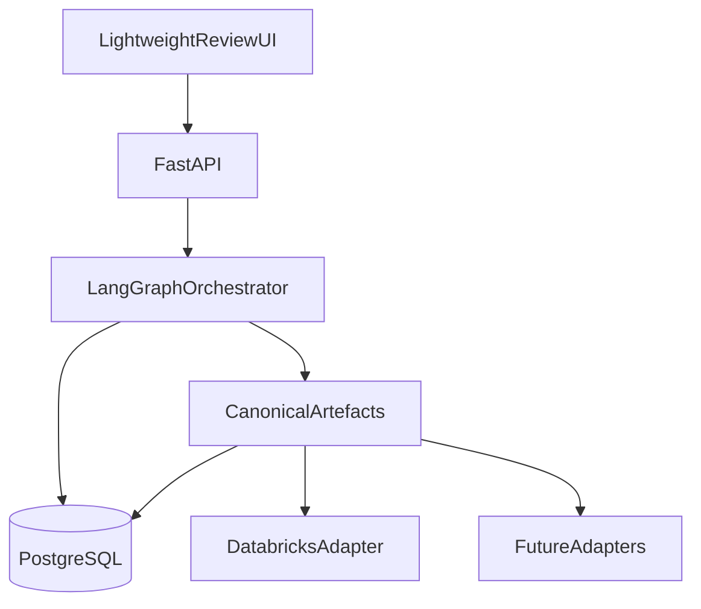

# Agentic Data Product Accelerator

**Agentic Data Product Design Platform** — transform business requirements into governed, technology-agnostic data product designs through multi-agent orchestration and human-in-the-loop review.

| | |
| --- | --- |
| **Status** | Milestone **M3** complete (requirements agent + mapping HITL) |
| **MVP target** | September 2026 |
| **Primary MVP user** | Data Consultant |
| **Stack** | Python 3.12 · uv · FastAPI · LangGraph · PostgreSQL |

---

## Overview

The accelerator helps teams design analytics-ready data products faster. AI agents will produce a **canonical data product model**; humans approve each stage before the workflow continues. Platform-specific assets (for example Databricks pipelines) are generated later via **adapters**.

**M0–M3 scope:** production skeleton, typed canonical artefacts, ArtefactStore, audit/lineage, durable LangGraph HITL, Requirements Agent (BR→TR), fixture-first mapping subgraph with judge retry caps, and production `/runs` APIs. No UI, live source connectors, or adapters yet.

Full product intent: [`PRODUCT_SPEC.md`](PRODUCT_SPEC.md).

---

## Vision and purpose

- Accelerate delivery and reduce technical bottlenecks in data product design.  
- Keep engineers and consultants as **reviewers**; agents as **builders** of canonical artefacts.  
- Remain **technology agnostic**: Databricks is the first adapter target for availability — not because the platform is Databricks-native.  
- Respect the **authenticated user’s** source-platform permissions; never bypass or elevate access.

---

## High-level architecture



Layers: **AI execution** (UI, API, LangGraph) → **canonical model** → **platform adapters**. Details: [`ARCHITECTURE.md`](ARCHITECTURE.md).

**M0–M3 implements:** FastAPI + config + logging + PostgreSQL + ArtefactStore + multi-stage HITL graph (TR + mapping) + LLM/discovery integrations + `/health` + `/ready` + `/runs` + `/dev` persistence APIs.

---

## Core concepts

| Concept | Meaning |
| --- | --- |
| **Canonical artefact** | Technology-agnostic, versioned definition of part of a data product |
| **HITL** | Workflow review point after each generated artefact |
| **Adapter** | Maps approved canonical artefacts to a target platform |
| **Artefact store** | Persistence abstraction (PostgreSQL in MVP; object storage later) |
| **Run** | One LangGraph execution thread (`run_id` = checkpointer `thread_id`) |

---

## Seven canonical artefacts

1. **Business Requirement**  
2. **Technical Requirement**  
3. **Semantic Model**  
4. **Data Model**  
5. **Pipeline Specification**  
6. **Metric Definitions**  
7. **Review Package**  

See [`PRODUCT_SPEC.md`](PRODUCT_SPEC.md) §5. Models and persistence are delivered in **M1** (complete).

---

## Human-in-the-loop workflow

| Decision | Effect |
| --- | --- |
| **Approve** | Continue to the next stage |
| **Reject** | Terminate the workflow |
| **Request revisions** | Regenerate the current artefact; review again |

Implemented in **M2** (complete). See [`adr/005-human-in-the-loop-workflow.md`](adr/005-human-in-the-loop-workflow.md) and [`docs/milestones/M2/`](docs/milestones/M2/).

---

## Technology stack

| Concern | Choice |
| --- | --- |
| Language / packaging | Python 3.12, **uv** |
| API | **FastAPI** + Uvicorn |
| Orchestration | **LangGraph** + PostgreSQL checkpointer (M3 requirements + mapping) |
| Persistence | **PostgreSQL** 16 + SQLAlchemy async + asyncpg |
| Quality | Ruff, Mypy, Pytest, Pre-commit, GitHub Actions |

---

## Current status

| Area | Status |
| --- | --- |
| Documentation baseline | Complete |
| **M0 scaffolding** | **Complete** — evidence in [`docs/milestones/M0/`](docs/milestones/M0/) |
| **M1 domain + persistence** | **Complete** — evidence in [`docs/milestones/M1/`](docs/milestones/M1/) |
| **M2 HITL skeleton** | **Complete** — evidence in [`docs/milestones/M2/`](docs/milestones/M2/) |
| **M3 requirements + mapping** | **Complete** — evidence in [`docs/milestones/M3/`](docs/milestones/M3/) |
| M4+ application features | Not started |

Assumptions: [`docs/M0_ASSUMPTIONS.md`](docs/M0_ASSUMPTIONS.md). Milestone close-out: [`docs/milestones/M0/`](docs/milestones/M0/) … [`docs/milestones/M3/`](docs/milestones/M3/).

---

## Repository structure

```text
.
├── adr/
├── docs/
│   └── milestones/M0/, M1/, M2/, M3/
├── src/agentic_data_product/
│   ├── app/                 # FastAPI (health/ready + /runs HITL + /dev)
│   ├── config/              # pydantic-settings (incl. LLM + mapping caps)
│   ├── observability/       # logging setup
│   ├── persistence/         # DB, migrations, ArtefactStore
│   ├── orchestration/       # LangGraph M3 graph + mapping + checkpointer
│   ├── agents/              # Requirements Agent (BR → TR)
│   ├── domain/              # canonical artefact + run/audit/lineage/review models
│   ├── integrations/        # LLM clients + fixture discovery
│   ├── adapters/            # reserved (M6)
│   └── ui/                  # reserved (M5)
├── tests/unit/
├── tests/integration/
├── docker-compose.yml
├── Dockerfile
├── pyproject.toml
└── .github/workflows/ci.yml
```

---

## Quick start

### Prerequisites

- Python 3.12+
- [uv](https://docs.astral.sh/uv/)
- Docker + Docker Compose (for PostgreSQL)

### 1. Install dependencies

```bash
cp .env.example .env
uv sync --group dev
```

### 2. Start PostgreSQL and migrate

```bash
make db
make migrate
```

Equivalent: `docker compose up -d postgres` then `uv run python -m agentic_data_product.persistence.migrate`.

### 3. Run the API

```bash
uv run uvicorn agentic_data_product.app.main:app --reload --host 0.0.0.0 --port 8000
```

Or: `make run` / `make dev`

### 4. Health endpoints

```bash
curl -s http://127.0.0.1:8000/health | python3 -m json.tool
curl -s http://127.0.0.1:8000/ready | python3 -m json.tool
```

- `GET /health` — process liveness (always 200 if the app is up)  
- `GET /ready` — PostgreSQL readiness (`200` ready / `503` unavailable)

### 5. Production run / HITL APIs (M3)

```bash
# Create a run — persists BR, generates Technical Requirement, pauses for TR review
curl -s -X POST http://127.0.0.1:8000/runs -H 'content-type: application/json' \
  -d '{
    "title":"demo",
    "created_by":"consultant",
    "user_context":{"user_id":"consultant"},
    "business_requirement":{
      "title":"Sales analytics",
      "intent":"Governed sales analytics data product",
      "objectives":["Analyse order amounts by customer and region"],
      "constraints":["Do not use inaccessible HR datasets"],
      "success_criteria":["TR and mapping approved"]
    }
  }' | python3 -m json.tool

# Inspect run (status, pending_review, latest_artefact)
curl -s http://127.0.0.1:8000/runs/<run_id> | python3 -m json.tool

# Approve Technical Requirement → mapping runs → waiting on Data Model slice
curl -s -X POST http://127.0.0.1:8000/runs/<run_id>/reviews \
  -H 'content-type: application/json' \
  -d '{"decision":"approve","comments":"TR ok","reviewer_id":"consultant"}' | python3 -m json.tool

# Approve mapping → run status approved (M3 exit)
curl -s -X POST http://127.0.0.1:8000/runs/<run_id>/reviews \
  -H 'content-type: application/json' \
  -d '{"decision":"approve","comments":"mapping ok","reviewer_id":"consultant"}' | python3 -m json.tool
```

| Decision | Effect |
| --- | --- |
| `approve` | Advance to next stage (TR → mapping; mapping → `approved`) |
| `reject` | Run status → `terminated` |
| `request_revisions` | Regenerate current stage artefact + return to `waiting_for_review` |

LLM config (optional): `LLM_PROVIDER=deterministic|openai_compatible`, `LLM_API_KEY`, `LLM_MODEL`, `LLM_BASE_URL`. Mapping retry caps: `MAPPING_SCHEMA_RETRY_CAP`, `MAPPING_LOGIC_RETRY_CAP`.

### 6. Dev persistence APIs (M1)

```bash
# Create a run row only (no graph) — useful for store/audit validation
curl -s -X POST http://127.0.0.1:8000/dev/runs -H 'content-type: application/json' \
  -d '{"title":"demo"}' | python3 -m json.tool
```

Routes: `POST/GET /dev/runs`, `POST/GET /dev/artefacts`, `POST/GET /dev/lineage`, `GET /dev/audit`.

### 7. Tests and quality

```bash
make verify   # lint, format check, mypy, unit + integration (requires Postgres + migrate)
```

Or individually:

```bash
uv run ruff check .
uv run ruff format --check .
uv run mypy src
uv run pytest tests/unit -q
uv run pytest tests/integration -q -m integration
```

### 8. Full stack via Docker Compose

```bash
docker compose up --build
```

API: http://localhost:8000/health

### 9. Pre-commit (optional local hooks)

```bash
uv run pre-commit install
uv run pre-commit run --all-files
```

---

## Roadmap

| Milestone | Focus |
| --- | --- |
| **M0** | Scaffold: uv, FastAPI, Postgres connectivity — **complete** |
| **M1** | Artefact schemas, ArtefactStore, audit/lineage — **complete** |
| **M2** | LangGraph + HITL skeleton — **complete** |
| **M3** | Requirements + mapping — **complete** |
| **M4–M7** | Modelling agents, UI, adapter, demo |

See [`IMPLEMENTATION_PLAN.md`](IMPLEMENTATION_PLAN.md).

---

## Contributing

See [`CONTRIBUTING.md`](CONTRIBUTING.md). Architecture decisions: [`adr/`](adr/).

---

## Documentation index

| Document | Purpose |
| --- | --- |
| [`PRODUCT_SPEC.md`](PRODUCT_SPEC.md) | What we build |
| [`ARCHITECTURE.md`](ARCHITECTURE.md) | How we build it |
| [`IMPLEMENTATION_PLAN.md`](IMPLEMENTATION_PLAN.md) | Milestones |
| [`docs/M0_ASSUMPTIONS.md`](docs/M0_ASSUMPTIONS.md) | M0 assumptions |
| [`docs/milestones/M0/`](docs/milestones/M0/) | M0 close-out evidence |
| [`docs/milestones/M1/`](docs/milestones/M1/) | M1 close-out evidence |
| [`docs/milestones/M2/`](docs/milestones/M2/) | M2 close-out evidence |
| [`docs/milestones/M3/`](docs/milestones/M3/) | M3 close-out evidence |
| [`adr/`](adr/) | Decision records |

---

## License

See [`LICENSE`](LICENSE) (placeholder until SPDX license is confirmed).
