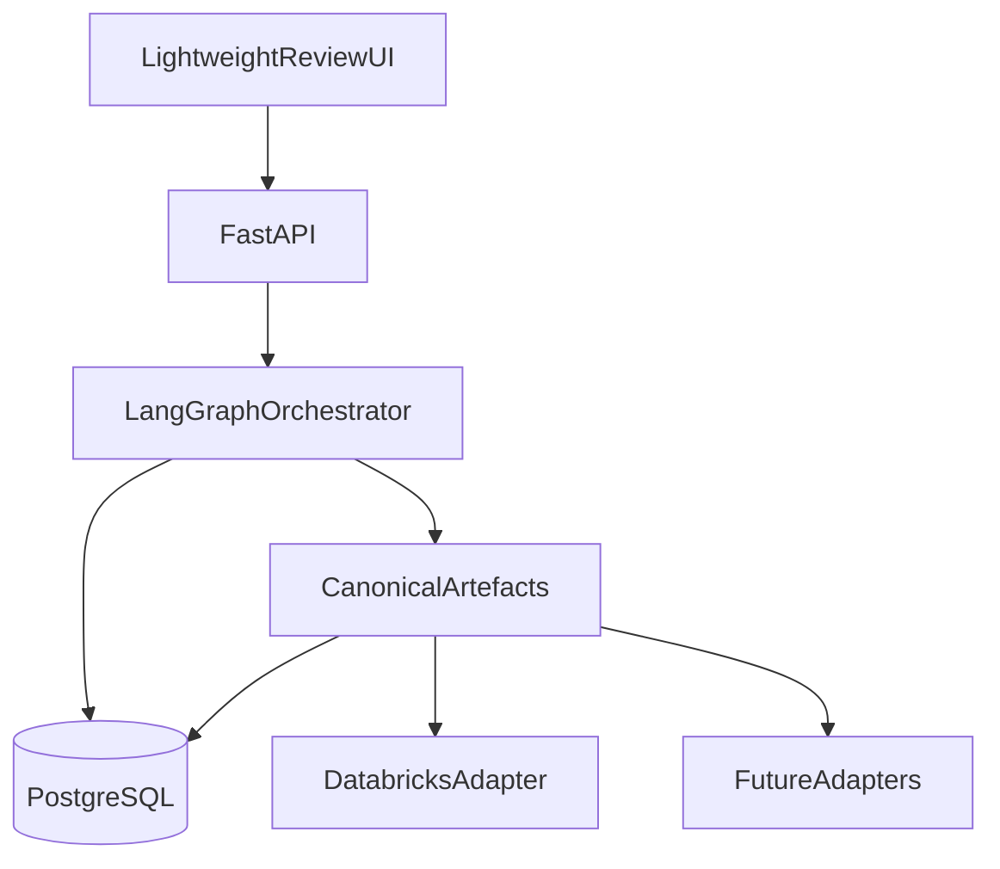

# Agentic Data Product Accelerator

**Agentic Data Product Design Platform** — transform business requirements into governed, technology-agnostic data product designs through multi-agent orchestration and human-in-the-loop review.

| | |
| --- | --- |
| **Status** | Milestone **M1** domain foundation (in progress) |
| **MVP target** | September 2026 |
| **Primary MVP user** | Data Consultant |
| **Stack** | Python 3.12 · uv · FastAPI · LangGraph (dep only) · PostgreSQL |

---

## Overview

The accelerator helps teams design analytics-ready data products faster. AI agents will produce a **canonical data product model**; humans approve each stage before the workflow continues. Platform-specific assets (for example Databricks pipelines) are generated later via **adapters**.

**M0 scope:** production-quality project skeleton only — no agents, graphs, artefacts, or adapters yet.

Full product intent: [`docs/PRODUCT_SPEC.md`](docs/PRODUCT_SPEC.md).

---

## Vision and purpose

- Accelerate delivery and reduce technical bottlenecks in data product design.  
- Keep engineers and consultants as **reviewers**; agents as **builders** of canonical artefacts.  
- Remain **technology agnostic**: Databricks is the first adapter target for availability — not because the platform is Databricks-native.  
- Respect the **authenticated user’s** source-platform permissions; never bypass or elevate access.

---

## High-level architecture



Layers: **AI execution** (UI, API, LangGraph) → **canonical model** → **platform adapters**. Details: [`docs/ARCHITECTURE.md`](docs/ARCHITECTURE.md).

**M0 implements:** FastAPI + config + logging + PostgreSQL connectivity + `/health` + `/ready`.

---

## Core concepts

| Concept | Meaning |
| --- | --- |
| **Canonical artefact** | Technology-agnostic, versioned definition of part of a data product |
| **HITL** | Workflow review point after each generated artefact |
| **Adapter** | Maps approved canonical artefacts to a target platform |
| **Artefact store** | Persistence abstraction (PostgreSQL in MVP; object storage later) |
| **Run** | One LangGraph execution thread (`run_id` = checkpointer `thread_id`) |

---

## Seven canonical artefacts

1. **Business Requirement**  
2. **Technical Requirement**  
3. **Semantic Model**  
4. **Data Model**  
5. **Pipeline Specification**  
6. **Metric Definitions**  
7. **Review Package**  

See [`docs/PRODUCT_SPEC.md`](docs/PRODUCT_SPEC.md) §5.

---

## Human-in-the-loop workflow

| Decision | Effect |
| --- | --- |
| **Approve** | Continue to the next stage |
| **Reject** | Terminate the workflow |
| **Request revisions** | Regenerate the current artefact; review again |

Implemented from **M2** onward. See [`docs/adr/005-human-in-the-loop-workflow.md`](docs/adr/005-human-in-the-loop-workflow.md).

---

## Technology stack

| Concern | Choice |
| --- | --- |
| Language / packaging | Python 3.12, **uv** |
| API | **FastAPI** + Uvicorn |
| Orchestration | **LangGraph** (dependency reserved; workflows from M2) |
| Persistence | **PostgreSQL** 16 + SQLAlchemy async + asyncpg |
| Quality | Ruff, Mypy, Pytest, Pre-commit, GitHub Actions |

---

## Current status

| Area | Status |
| --- | --- |
| Documentation baseline | Complete |
| **M0 scaffolding** | Complete |
| **M1 domain foundation** | In progress on `feature/m1-domain-foundation` |

Assumptions: [`docs/M0_ASSUMPTIONS.md`](docs/M0_ASSUMPTIONS.md).

---

## Repository structure

```text
.
├── docs/
│   ├── adr/
│   ├── PRODUCT_SPEC.md
│   ├── ARCHITECTURE.md
│   └── IMPLEMENTATION_PLAN.md
├── src/agentic_data_product/
│   ├── app/                 # FastAPI (main, health/ready)
│   ├── config/              # pydantic-settings
│   ├── observability/       # logging setup
│   ├── persistence/         # DB engine + ping (M0)
│   ├── orchestration/       # reserved (M2+)
│   ├── domain/              # reserved (M1)
│   ├── integrations/        # reserved
│   ├── adapters/            # reserved (M6)
│   └── ui/                  # reserved (M5)
├── tests/unit/
├── tests/integration/
├── docker-compose.yml
├── Dockerfile
├── pyproject.toml
└── .github/workflows/ci.yml
```

---

## Quick start

### Prerequisites

- Python 3.12+
- [uv](https://docs.astral.sh/uv/)
- Docker + Docker Compose (for PostgreSQL)

## Developer commands

Use these commands during day-to-day development:

```bash
make help      # list commands
make db        # start PostgreSQL
make migrate   # apply migrations
make dev       # run FastAPI locally
make lint      # ruff + format check + mypy
make test      # unit + integration (integration only when PostgreSQL is running)
make verify    # full validation pipeline with PASS/FAIL summary
make clean     # remove cache/temp files
make db-stop   # stop PostgreSQL
```

When to use:

- `make dev`: while implementing API or persistence changes.
- `make lint`: quick local quality gate before commit.
- `make test`: run automated tests for behavior validation.
- `make verify`: pre-PR full pipeline check.
- `make clean`: reset local caches when tool output looks stale.

### 1. Install dependencies

```bash
cp .env.example .env
uv sync --group dev
```

### 2. Start PostgreSQL

```bash
docker compose up -d postgres
```

### 3. Apply database migrations

```bash
uv run adp-migrate
```

### 4. Run the API

```bash
uv run uvicorn agentic_data_product.app.main:app --reload --host 0.0.0.0 --port 8000
```

Or: `make dev`

### 5. Health endpoints

```bash
curl -s http://127.0.0.1:8000/health | python3 -m json.tool
curl -s http://127.0.0.1:8000/ready | python3 -m json.tool
```

- `GET /health` — process liveness (always 200 if the app is up)  
- `GET /ready` — PostgreSQL readiness (`200` ready / `503` unavailable)

### 6. M1 development persistence endpoints

Examples:

```bash
# Create run
curl -s -X POST http://127.0.0.1:8000/dev/runs \
  -H "content-type: application/json" \
  -d '{"name":"demo-run","metadata":{"source":"manual"}}' | python3 -m json.tool

# Create artefact (business requirement)
curl -s -X POST http://127.0.0.1:8000/dev/artefacts \
  -H "content-type: application/json" \
  -d '{"run_id":"<RUN_ID>","artefact_type":"business_requirement","payload":{"intent":"Validate M1","objectives":["Store data"],"constraints":[],"success_criteria":["Retrievable"]}}' | python3 -m json.tool

# List artefacts and audit
curl -s "http://127.0.0.1:8000/dev/artefacts?run_id=<RUN_ID>" | python3 -m json.tool
curl -s "http://127.0.0.1:8000/dev/audit?run_id=<RUN_ID>" | python3 -m json.tool
```

### 7. Tests and quality

```bash
uv run ruff check .
uv run ruff format --check .
uv run mypy src
uv run pytest tests/unit -q
uv run pytest tests/integration -q -m integration   # requires Postgres
```

Or: `make lint typecheck test-unit`

### 8. Full stack via Docker Compose

```bash
docker compose up --build
```

API: http://localhost:8000/health

### 9. Pre-commit (optional local hooks)

```bash
uv run pre-commit install
uv run pre-commit run --all-files
```

---

## Roadmap

| Milestone | Focus |
| --- | --- |
| **M0** | Scaffold: uv, FastAPI, Postgres connectivity |
| **M1** | Artefact schemas, ArtefactStore, workflow metadata, migrations |
| **M2** | LangGraph + HITL skeleton |
| **M3–M7** | Agents, UI, adapter, demo |

See [`docs/IMPLEMENTATION_PLAN.md`](docs/IMPLEMENTATION_PLAN.md).

---

## Contributing

See [`docs/CONTRIBUTING.md`](docs/CONTRIBUTING.md). Architecture decisions: [`docs/adr/`](docs/adr/).

---

## Documentation index

| Document | Purpose |
| --- | --- |
| [`docs/PRODUCT_SPEC.md`](docs/PRODUCT_SPEC.md) | What we build |
| [`docs/ARCHITECTURE.md`](docs/ARCHITECTURE.md) | How we build it |
| [`docs/IMPLEMENTATION_PLAN.md`](docs/IMPLEMENTATION_PLAN.md) | Milestones |
| [`docs/M0_ASSUMPTIONS.md`](docs/M0_ASSUMPTIONS.md) | M0 assumptions |
| [`docs/adr/`](docs/adr/) | Decision records |

---

## License

See [`LICENSE`](LICENSE) (placeholder until SPDX license is confirmed).
