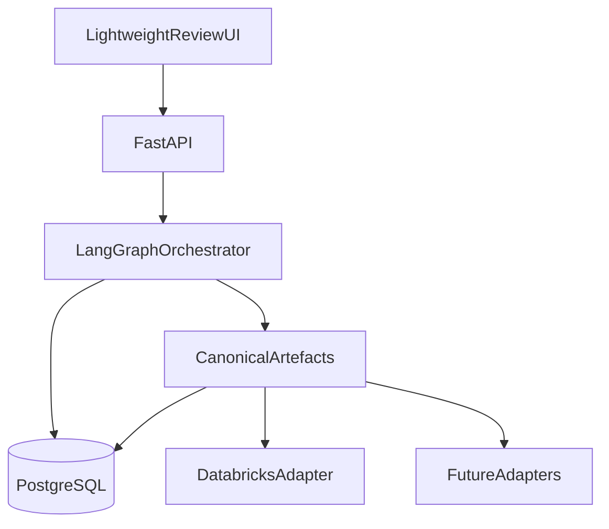

# Agentic Data Product Accelerator

**Agentic Data Product Design Platform** — transform business requirements into governed, technology-agnostic data product designs through multi-agent orchestration and human-in-the-loop review.

| | |
| --- | --- |
| **Status** | Documentation baseline complete — implementation starts at Milestone **M0** |
| **MVP target** | September 2026 |
| **Primary MVP user** | Data Consultant |
| **Stack** | Python · uv · FastAPI · LangGraph · PostgreSQL |

---

## Overview

The accelerator helps teams design analytics-ready data products faster. AI agents produce a **canonical data product model**; humans approve each stage before the workflow continues. Platform-specific assets (for example Databricks pipelines) are generated later via **adapters** — the core product is not a vendor code generator.

**Long-term vision:** enable Business User self-service.  
**MVP focus:** Data Consultants demonstrating AI-assisted design with a lightweight review UI.

Full product intent: [`PRODUCT_SPEC.md`](PRODUCT_SPEC.md).

---

## Vision and purpose

- Accelerate delivery and reduce technical bottlenecks in data product design.  
- Keep engineers and consultants as **reviewers**; agents as **builders** of canonical artefacts.  
- Remain **technology agnostic**: Databricks is the first adapter target because it is available for development and demo — not because the platform is Databricks-native.  
- Respect the **authenticated user’s** source-platform permissions; never bypass or elevate access.

---

## High-level architecture



Layers: **AI execution** (UI, API, LangGraph) → **canonical model** (versioned artefacts, audit, lineage) → **platform adapters**. Details: [`ARCHITECTURE.md`](ARCHITECTURE.md).

---

## Core concepts

| Concept | Meaning |
| --- | --- |
| **Canonical artefact** | Technology-agnostic, versioned definition of part of a data product |
| **HITL** | Workflow review point after each generated artefact |
| **Adapter** | Maps approved canonical artefacts to a target platform |
| **Artefact store** | Persistence abstraction (PostgreSQL in MVP; object storage later) |
| **Run** | One LangGraph execution thread (`run_id` = checkpointer `thread_id`) |

---

## Seven canonical artefacts

1. **Business Requirement** — intent, objectives, constraints, success criteria  
2. **Technical Requirement** — behaviour, entities, transformations, governance, acceptance criteria  
3. **Semantic Model** — metrics, dimensions, hierarchies, relationships, business definitions  
4. **Data Model** — datasets, entities, attributes, keys, relationships  
5. **Pipeline Specification** — declarative ingestion, transform, orchestration, validation, operations  
6. **Metric Definitions** — portable KPI calculations, aggregations, filters, grain  
7. **Review Package** — consolidated artefacts, assumptions, traceability, validation, open questions, recommendations  

These artefacts are the source of truth for a data product. See [`PRODUCT_SPEC.md`](PRODUCT_SPEC.md) §5 and [`adr/002-canonical-artefacts.md`](adr/002-canonical-artefacts.md).

---

## Human-in-the-loop workflow

Each AI-generated artefact is reviewed before the next stage:

| Decision | Effect |
| --- | --- |
| **Approve** | Continue to the next stage |
| **Reject** | Terminate the workflow |
| **Request revisions** | Provide feedback; regenerate the **current** artefact; review again |

Lightweight MVP UI: submit requirements, view progress, review artefacts, record decisions. See [`adr/005-human-in-the-loop-workflow.md`](adr/005-human-in-the-loop-workflow.md).

---

## Technology stack

| Concern | Choice |
| --- | --- |
| Language / packaging | Python, **uv** |
| API | **FastAPI** |
| Orchestration | **LangGraph** |
| Persistence / checkpointer | **PostgreSQL** |
| First platform adapter | **Databricks** (Fabric, Snowflake, Power BI planned later) |

---

## Current status

| Area | Status |
| --- | --- |
| Product specification | Baseline ([`PRODUCT_SPEC.md`](PRODUCT_SPEC.md)) |
| Architecture | Baseline ([`ARCHITECTURE.md`](ARCHITECTURE.md)) |
| Implementation plan | M0–M7 defined ([`IMPLEMENTATION_PLAN.md`](IMPLEMENTATION_PLAN.md)) |
| ADRs | Initial set under [`adr/`](adr/) |
| Application code | **Not started** — begin with **Milestone M0** |

---

## Repository structure (anticipated)

```text
.
├── PRODUCT_SPEC.md
├── ARCHITECTURE.md
├── ARCHITECTURE_REVIEW.md
├── IMPLEMENTATION_PLAN.md
├── README.md
├── CONTRIBUTING.md
├── LICENSE
├── adr/
├── src/
│   ├── app/                 # FastAPI
│   ├── orchestration/       # LangGraph
│   ├── domain/              # Canonical artefacts
│   ├── persistence/         # ArtefactStore, audit, lineage
│   ├── integrations/        # LLM, source discovery
│   ├── adapters/            # databricks/, ...
│   └── ui/                  # Lightweight review UI
├── tests/
└── pyproject.toml           # uv-managed (M0)
```

---

## Quick start

> Placeholders until M0 lands. Commands will be confirmed in the runbook.

```bash
# Prerequisites (expected): Python 3.12+, uv, Docker (for PostgreSQL)

git clone <repository-url>
cd agentic-data-product-accelerator

# Install dependencies (after pyproject.toml exists)
uv sync

# Start PostgreSQL (example)
# docker compose up -d postgres

# Run API (example)
# uv run uvicorn app.main:app --reload

# Run tests (example)
# uv run pytest
```

Environment variables (to be documented in M0): database URL, LLM credentials, optional Databricks token for user-scoped discovery.

---

## Roadmap

| Milestone | Focus |
| --- | --- |
| **M0** | Scaffold: uv, FastAPI, Postgres connectivity |
| **M1** | Artefact schemas, ArtefactStore, audit/lineage |
| **M2** | LangGraph + HITL skeleton (Approve / Reject / Request revisions) |
| **M3** | Requirements + mapping agents |
| **M4** | Modelling, pipeline/metrics, Review Package |
| **M5** | Lightweight UI + observability |
| **M6** | Databricks adapter boundary + hardening |
| **M7** | MVP demo and definition-of-done |

Post-MVP: richer UI, Business User journeys, additional adapters, optional application RBAC for multi-tenant hosting. See [`IMPLEMENTATION_PLAN.md`](IMPLEMENTATION_PLAN.md).

---

## Contributing

See [`CONTRIBUTING.md`](CONTRIBUTING.md) for branching, commits, PR expectations, coding standards, and how to add nodes, artefacts, and adapters.

Architecture decisions are recorded in [`adr/`](adr/). Prefer ADRs over long PR debates for cross-cutting choices.

---

## Documentation index

| Document | Purpose |
| --- | --- |
| [`PRODUCT_SPEC.md`](PRODUCT_SPEC.md) | What we build and why |
| [`ARCHITECTURE.md`](ARCHITECTURE.md) | How we build it |
| [`IMPLEMENTATION_PLAN.md`](IMPLEMENTATION_PLAN.md) | Delivery milestones |
| [`ARCHITECTURE_REVIEW.md`](ARCHITECTURE_REVIEW.md) | Design review and open engineering questions |
| [`adr/`](adr/) | Why key decisions were made |

---

## License

Copyright © project stakeholders. License terms to be confirmed — see `LICENSE` (placeholder).
