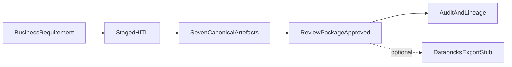

# M7 architectural notes

M7 does not change the core orchestration model. It closes the demo surface over M0–M6:

```text
Browser (/ui/)
  → POST /runs
  → GET  /runs/{id}
  → GET  /runs/{id}/artefacts…
  → POST /runs/{id}/reviews
  → GET  /runs/{id}/events          (audit)
  → GET  /runs/{id}/lineage         (G3 — production)
  → POST /runs/{id}/export          (optional adapter stub)
  → GET  /config/profile
```



- Agents still write **only** canonical artefacts.
- “Publish” means Review Package `decision_state=approved` in PostgreSQL.
- Databricks output is adapter-derived and labeled `export_stub` — not the product identity.
